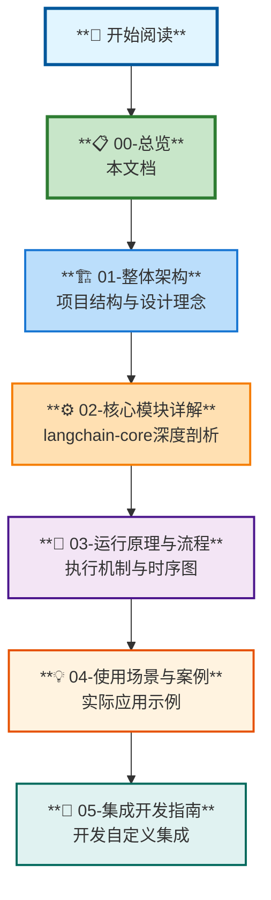
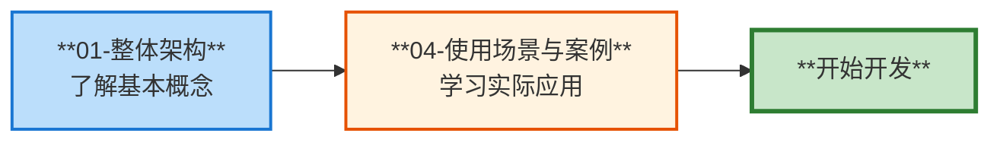
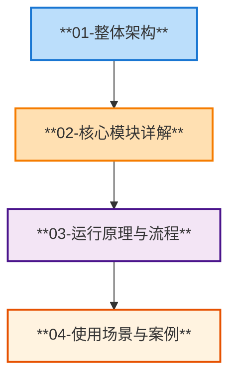
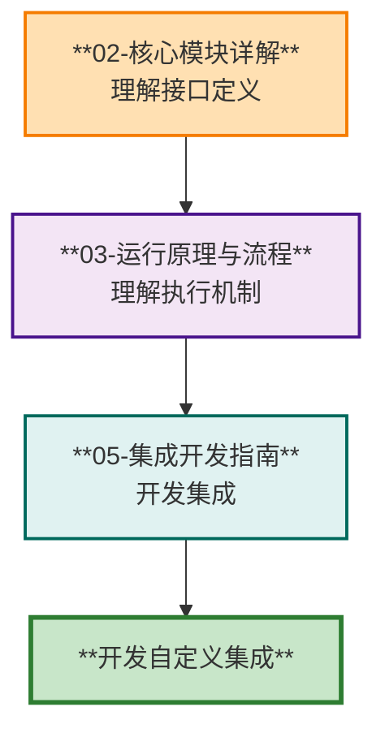
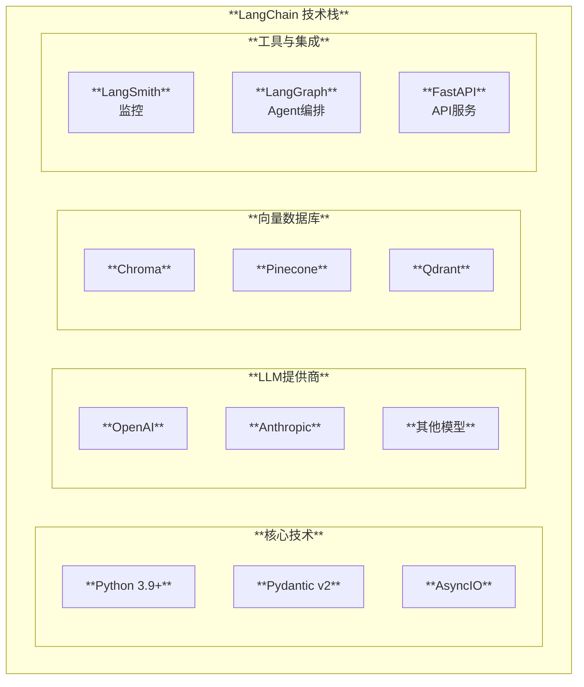

# LangChain 项目完整解析 - 总览

## 📚 文档导航

欢迎阅读 LangChain 项目的完整源码分析文档。本系列文档深入解析了 LangChain 的架构、模块、运行原理和使用场景。



## 📖 文档列表

### 1. [整体架构](./01-整体架构.md)

**适合读者**：希望了解 LangChain 整体设计的开发者

**主要内容**：
- ✅ 项目概述与核心特点
- ✅ Monorepo 结构详解
- ✅ 核心架构层次
- ✅ 设计理念（Runnable、LCEL、回调系统）
- ✅ 数据流转机制
- ✅ 扩展机制
- ✅ 生态系统集成

**关键图表**：
- 项目模块依赖图
- 架构分层图
- 数据流转图
- 生态系统集成图

---

### 2. [核心模块详解](./02-核心模块详解.md)

**适合读者**：需要深入理解核心抽象的开发者

**主要内容**：
- ✅ langchain-core 模块结构
- ✅ Runnable 核心抽象详解
- ✅ 语言模型抽象（BaseChatModel、BaseLLM）
- ✅ 消息系统设计
- ✅ 提示模板机制
- ✅ 工具系统架构
- ✅ 输出解析器
- ✅ 回调系统
- ✅ 检索器抽象
- ✅ 文档数据结构

**关键图表**：
- 核心模块结构图
- Runnable 类图
- 语言模型继承关系
- 消息类型层次
- 工具系统架构

---

### 3. [运行原理与流程](./03-运行原理与流程.md)

**适合读者**：想要掌握执行机制的开发者

**主要内容**：
- ✅ 基础执行流程（invoke）
- ✅ 流式处理原理
- ✅ 批量处理机制
- ✅ LCEL 组合执行
  - 顺序组合（Sequence）
  - 并行组合（Parallel）
  - 条件分支（Branch）
- ✅ Agent 执行循环
- ✅ 回调系统执行流程
- ✅ 错误处理与重试
- ✅ 性能优化策略
- ✅ 调试与监控

**关键图表**：
- 单次调用时序图
- 流式处理时序图
- 批量处理时序图
- Agent 执行流程图
- 回调传播机制图

---

### 4. [使用场景与案例](./04-使用场景与案例.md)

**适合读者**：实际应用开发者

**主要内容**：
- ✅ RAG（检索增强生成）系统
  - 架构设计
  - 完整实现代码
  - 工作流程
- ✅ Agent 工具调用系统
  - Agent 架构
  - 实现示例
  - 执行流程
- ✅ 对话式聊天机器人
  - 对话系统架构
  - 记忆管理
  - 实现代码
- ✅ 结构化数据提取
  - 数据提取流程
  - Pydantic 集成
  - 应用场景
- ✅ 多文档问答系统
  - 系统架构
  - 文档处理
  - 混合检索
- ✅ 代码助手
  - 代码生成架构
  - 质量保证
- ✅ 场景对比与选择指南
- ✅ 最佳实践
- ✅ 生产部署建议

**关键图表**：
- RAG 系统架构图
- Agent 系统架构图
- 对话流程时序图
- 场景选择决策树
- 部署架构图

---

### 5. [集成开发指南](./05-集成开发指南.md)

**适合读者**：希望开发自定义集成的开发者

**主要内容**：
- ✅ Partner 包架构
- ✅ 标准目录结构
- ✅ 开发 ChatModel 集成
  - 实现架构
  - 完整代码模板
  - 集成工作流
- ✅ 开发 Embeddings 集成
- ✅ 开发 VectorStore 集成
- ✅ 开发工具集成
- ✅ 测试开发
  - 测试金字塔
  - 单元测试
  - 集成测试
  - 标准测试套件
- ✅ 配置与发布
- ✅ 最佳实践
- ✅ 发布流程

**关键图表**：
- Partner 包结构图
- ChatModel 实现类图
- 测试金字塔
- 发布流程图

---

## 🎯 学习路径推荐

### 路径 1：快速入门

适合：想要快速上手使用 LangChain 的开发者



**建议顺序**：
1. 阅读 [01-整体架构](./01-整体架构.md) 了解基本概念
2. 阅读 [04-使用场景与案例](./04-使用场景与案例.md) 选择合适的场景
3. 参考示例代码开始开发

---

### 路径 2：深度理解

适合：想要深入理解 LangChain 内部机制的开发者



**建议顺序**：
1. [01-整体架构](./01-整体架构.md) - 建立整体认知
2. [02-核心模块详解](./02-核心模块详解.md) - 理解核心抽象
3. [03-运行原理与流程](./03-运行原理与流程.md) - 掌握执行机制
4. [04-使用场景与案例](./04-使用场景与案例.md) - 实践应用

---

### 路径 3：集成开发

适合：需要开发自定义集成的开发者



**建议顺序**：
1. [02-核心模块详解](./02-核心模块详解.md) - 理解基类接口
2. [03-运行原理与流程](./03-运行原理与流程.md) - 了解执行流程
3. [05-集成开发指南](./05-集成开发指南.md) - 参考开发指南
4. 开始开发自定义集成

---

## 📊 文档统计

| 文档 | 主要图表数量 | 代码示例 | 页面长度 |
|------|------------|---------|---------|
| 01-整体架构 | 8个 | 5+ | 长 |
| 02-核心模块详解 | 10个 | 10+ | 很长 |
| 03-运行原理与流程 | 12个 | 8+ | 很长 |
| 04-使用场景与案例 | 12个 | 6+ | 超长 |
| 05-集成开发指南 | 6个 | 10+ | 长 |
| **总计** | **48+** | **39+** | **~35页** |

## 🎨 图表说明

本文档系列使用 Mermaid 绘制各类图表，包括：

- **架构图**：展示模块结构和依赖关系
- **时序图**：展示执行流程和交互过程
- **类图**：展示类继承关系
- **流程图**：展示处理流程和逻辑
- **状态图**：展示状态转换
- **思维导图**：展示概念层次

### 图表样式规范

所有图表都遵循以下设计原则：
- ✅ **文字加粗**：确保可读性
- ✅ **背景颜色浅**：不遮挡文字
- ✅ **边框清晰**：结构分明
- ✅ **颜色区分**：不同类型使用不同颜色

## 🔧 技术栈概览



## 📝 核心概念速查

| 概念 | 说明 | 详见文档 |
|------|------|---------|
| **Runnable** | 核心可执行抽象 | [02-核心模块](./02-核心模块详解.md#3-runnable核心抽象) |
| **LCEL** | LangChain表达式语言 | [01-整体架构](./01-整体架构.md#42-lcel) |
| **Chain** | 组件链式组合 | [03-运行原理](./03-运行原理与流程.md#5-lcel-组合执行) |
| **Agent** | 智能代理系统 | [04-使用场景](./04-使用场景与案例.md#4-场景二agent-工具调用) |
| **RAG** | 检索增强生成 | [04-使用场景](./04-使用场景与案例.md#3-场景一rag检索增强生成) |
| **Callback** | 回调监控系统 | [02-核心模块](./02-核心模块详解.md#9-回调系统) |
| **Tool** | 工具系统 | [02-核心模块](./02-核心模块详解.md#7-工具系统) |
| **Prompt** | 提示模板 | [02-核心模块](./02-核心模块详解.md#6-提示模板) |
| **Memory** | 记忆系统 | [04-使用场景](./04-使用场景与案例.md#5-场景三对话式聊天机器人) |
| **Retriever** | 检索器 | [02-核心模块](./02-核心模块详解.md#10-检索器抽象) |

## 🚀 快速开始示例

### 最简单的 Chain

```python
from langchain_openai import ChatOpenAI
from langchain_core.prompts import ChatPromptTemplate
from langchain_core.output_parsers import StrOutputParser

# 使用 LCEL 构建链
chain = (
    ChatPromptTemplate.from_template("告诉我关于{topic}的笑话")
    | ChatOpenAI()
    | StrOutputParser()
)

# 调用
result = chain.invoke({"topic": "程序员"})
print(result)
```

### RAG 系统

```python
from langchain_community.vectorstores import Chroma
from langchain_openai import OpenAIEmbeddings, ChatOpenAI
from langchain_core.prompts import ChatPromptTemplate

# 创建向量存储
vectorstore = Chroma.from_texts(
    texts=["LangChain是一个LLM框架", "支持多种模型"],
    embedding=OpenAIEmbeddings()
)

# 构建 RAG 链
rag_chain = (
    {"context": vectorstore.as_retriever(), "question": lambda x: x}
    | ChatPromptTemplate.from_template("基于{context}回答：{question}")
    | ChatOpenAI()
)

result = rag_chain.invoke("什么是LangChain？")
```

### Agent 系统

```python
from langchain.agents import create_tool_calling_agent, AgentExecutor
from langchain_openai import ChatOpenAI
from langchain_core.tools import tool

@tool
def calculator(expression: str) -> str:
    """计算数学表达式"""
    return str(eval(expression))

# 创建 Agent
agent = create_tool_calling_agent(
    llm=ChatOpenAI(),
    tools=[calculator],
    prompt=ChatPromptTemplate.from_template("{input}")
)

executor = AgentExecutor(agent=agent, tools=[calculator])
result = executor.invoke({"input": "25 * 4 等于多少？"})
```

## 🔍 常见问题

### Q1: 应该从哪个文档开始阅读？

**A**: 取决于你的目标：
- **快速应用**：从 [01-整体架构](./01-整体架构.md) 和 [04-使用场景](./04-使用场景与案例.md) 开始
- **深入理解**：按顺序阅读所有文档
- **开发集成**：重点阅读 [02-核心模块](./02-核心模块详解.md) 和 [05-集成开发](./05-集成开发指南.md)

### Q2: 图表无法显示怎么办？

**A**: 本文档使用 Mermaid 格式绘制图表：
- GitHub 原生支持 Mermaid 显示
- VS Code 可安装 Markdown Preview Mermaid Support 插件
- 在线查看可使用 [Mermaid Live Editor](https://mermaid.live/)

### Q3: 如何贡献和反馈？

**A**:
- 发现错误或有改进建议，请提 Issue
- 欢迎提交 Pull Request
- 遵循项目的贡献指南

## 🎓 推荐资源

### 官方资源

- [LangChain 官方文档](https://docs.langchain.com/)
- [API 参考文档](https://reference.langchain.com/python)
- [LangChain GitHub](https://github.com/langchain-ai/langchain)
- [LangSmith](https://smith.langchain.com/)
- [LangGraph](https://github.com/langchain-ai/langgraph)

### 社区资源

- [LangChain 论坛](https://forum.langchain.com/)
- [Discord 社区](https://discord.gg/langchain)
- [Twitter @langchainai](https://twitter.com/langchainai)

## 📅 文档更新记录

| 版本 | 日期 | 更新内容 |
|------|------|---------|
| 1.0 | 2025-11-22 | 初始版本，包含5个主要文档 |

## 📄 许可证

本文档系列基于源码分析创建，遵循 LangChain 项目的 MIT 许可证。

---

## 🎯 开始学习

选择你的学习路径，开始探索 LangChain 的世界：

1. 📖 [整体架构](./01-整体架构.md) - 建立全局认知
2. ⚙️ [核心模块详解](./02-核心模块详解.md) - 深入核心机制
3. 🔄 [运行原理与流程](./03-运行原理与流程.md) - 理解执行过程
4. 💡 [使用场景与案例](./04-使用场景与案例.md) - 学习实际应用
5. 🔌 [集成开发指南](./05-集成开发指南.md) - 开发自定义集成

**祝你学习愉快！** 🚀

---

**文档版本**: 1.0
**最后更新**: 2025-11-22
**维护者**: LangChain 中文文档项目组

