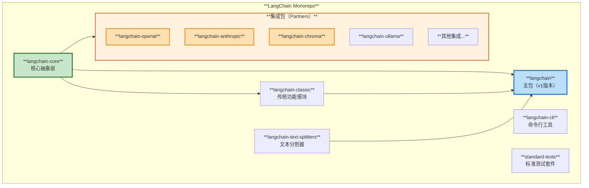
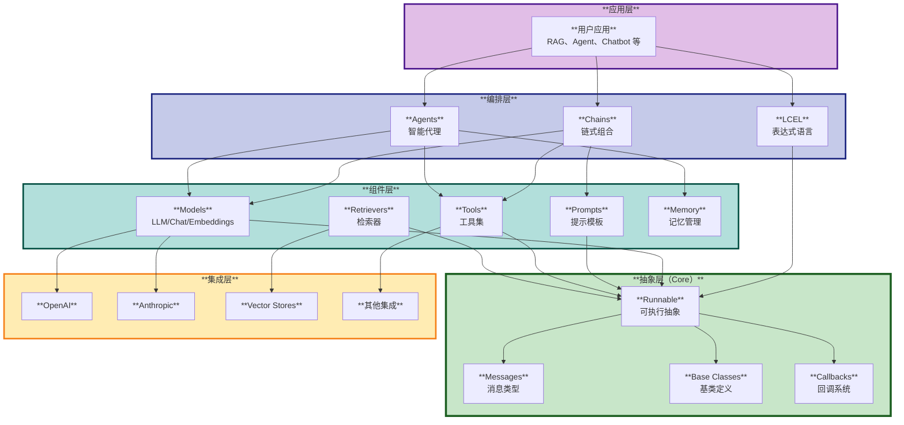
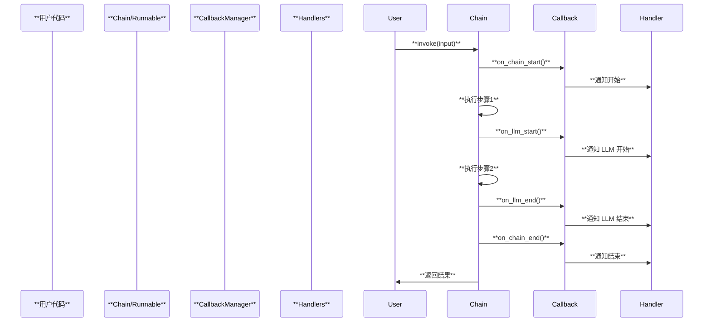
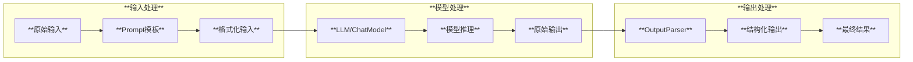
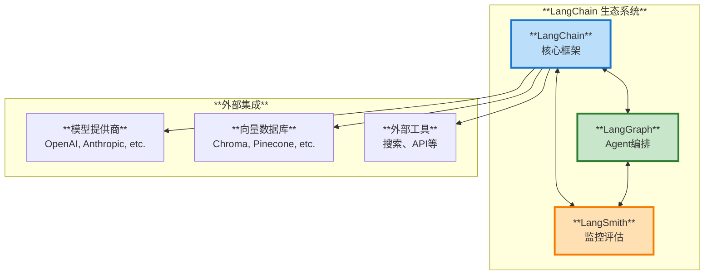

# LangChain 整体架构

## 1. 项目概述

LangChain 是一个用于构建基于大语言模型（LLM）的应用程序的强大框架。它提供了一套完整的工具和抽象，帮助开发者构建可靠的 Agent 和 LLM 驱动的应用。

### 核心特点

- **模块化设计**：组件之间相互独立，易于替换和扩展
- **模型互操作性**：轻松切换不同的 LLM 模型
- **生产就绪**：内置监控、评估和调试支持
- **丰富的集成**：支持众多模型提供商和工具
- **LCEL 表达式语言**：声明式的链式调用方式

## 2. 项目结构

LangChain 采用 **Monorepo** 架构，主要包含以下核心模块：



### 模块说明

| 模块 | 说明 | 主要功能 |
|------|------|----------|
| **langchain-core** | 核心抽象层 | 定义基础接口、Runnable、LCEL、消息类型等 |
| **langchain** | 主包（v1） | 提供高层 API，整合所有功能 |
| **langchain-classic** | 传统功能 | 包含遗留的 Chain、Memory、社区集成等 |
| **langchain-cli** | CLI 工具 | 项目脚手架、模板生成等 |
| **partners/** | 第三方集成 | OpenAI、Anthropic、Chroma 等集成包 |
| **text-splitters** | 文本分割 | 各种文本分割策略 |
| **standard-tests** | 标准测试 | 通用测试工具和标准测试套件 |

## 3. 核心架构层次

LangChain 采用分层架构，从底层到高层依次为：



## 4. 核心设计理念

### 4.1 Runnable 接口

**Runnable** 是 LangChain 的核心抽象，所有组件都实现了这个接口。它提供了统一的调用方式：

```python
# 所有 Runnable 都支持这些方法
result = runnable.invoke(input)           # 同步调用
result = await runnable.ainvoke(input)    # 异步调用
results = runnable.batch([input1, input2]) # 批量处理
for chunk in runnable.stream(input):      # 流式输出
    print(chunk)
```

### 4.2 LCEL（LangChain Expression Language）

LCEL 提供声明式的组合方式，使用 `|` 操作符连接组件：

```python
chain = prompt | model | output_parser
result = chain.invoke({"input": "你好"})
```

### 4.3 回调系统

完整的回调系统支持监控、日志和调试：



## 5. 数据流转



## 6. 扩展机制

LangChain 支持多种扩展方式：

### 6.1 自定义组件

```python
from langchain_core.runnables import RunnableLambda

def custom_function(x):
    return x.upper()

custom_component = RunnableLambda(custom_function)
chain = prompt | model | custom_component
```

### 6.2 自定义工具

```python
from langchain_core.tools import tool

@tool
def my_tool(query: str) -> str:
    """工具描述"""
    return "处理结果"
```

### 6.3 自定义模型

```python
from langchain_core.language_models import BaseChatModel

class MyCustomModel(BaseChatModel):
    def _generate(self, messages, stop=None, **kwargs):
        # 实现模型逻辑
        pass
```

## 7. 与生态系统的集成



## 8. 关键特性

### 8.1 同步/异步支持

所有 Runnable 组件自动支持同步和异步调用：

- `invoke()` / `ainvoke()`
- `batch()` / `abatch()`
- `stream()` / `astream()`

### 8.2 流式处理

支持实时流式输出，提升用户体验：

```python
for chunk in chain.stream(input):
    print(chunk, end="", flush=True)
```

### 8.3 批量处理

内置批量处理优化，提高吞吐量：

```python
results = chain.batch([input1, input2, input3])
```

### 8.4 错误处理

支持重试、降级等错误处理策略：

```python
chain_with_retry = chain.with_retry(
    stop_after_attempt=3,
    wait_exponential_jitter=True
)

chain_with_fallback = primary_chain.with_fallbacks([backup_chain])
```

## 9. 下一步

本文档提供了 LangChain 的整体架构概览。更多详细信息请参考：

- [核心模块详解](./02-核心模块详解.md) - 深入了解 langchain-core
- [运行原理与流程](./03-运行原理与流程.md) - 理解执行机制
- [使用场景与案例](./04-使用场景与案例.md) - 实际应用示例

---

**文档版本**: 1.0
**最后更新**: 2025-11-22

