# LangChain 核心模块详解

## 1. langchain-core 概述

`langchain-core` 是 LangChain 生态系统的基石，定义了所有核心抽象和接口。它保持轻量级依赖，不包含任何第三方集成。

### 设计原则

- **模块化**：组件相互独立
- **稳定性**：承诺稳定的版本控制
- **久经考验**：拥有最大的安装基数

## 2. 核心模块结构

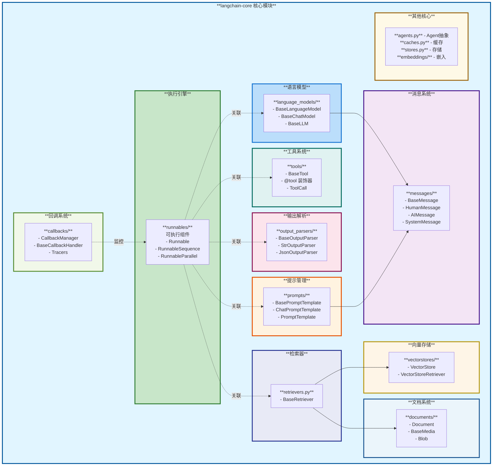

## 3. Runnable：核心抽象

### 3.1 Runnable 接口

`Runnable` 是所有可执行组件的基类，定义了统一的调用接口：

```python
class Runnable(ABC, Generic[Input, Output]):
    """可调用、批处理、流式、转换和组合的工作单元"""

    def invoke(self, input: Input, config: RunnableConfig = None) -> Output:
        """同步调用"""

    async def ainvoke(self, input: Input, config: RunnableConfig = None) -> Output:
        """异步调用"""

    def batch(self, inputs: List[Input], config: RunnableConfig = None) -> List[Output]:
        """批量处理"""

    async def abatch(self, inputs: List[Input], config: RunnableConfig = None) -> List[Output]:
        """异步批量处理"""

    def stream(self, input: Input, config: RunnableConfig = None) -> Iterator[Output]:
        """流式输出"""

    async def astream(self, input: Input, config: RunnableConfig = None) -> AsyncIterator[Output]:
        """异步流式输出"""
```

### 3.2 组合方式

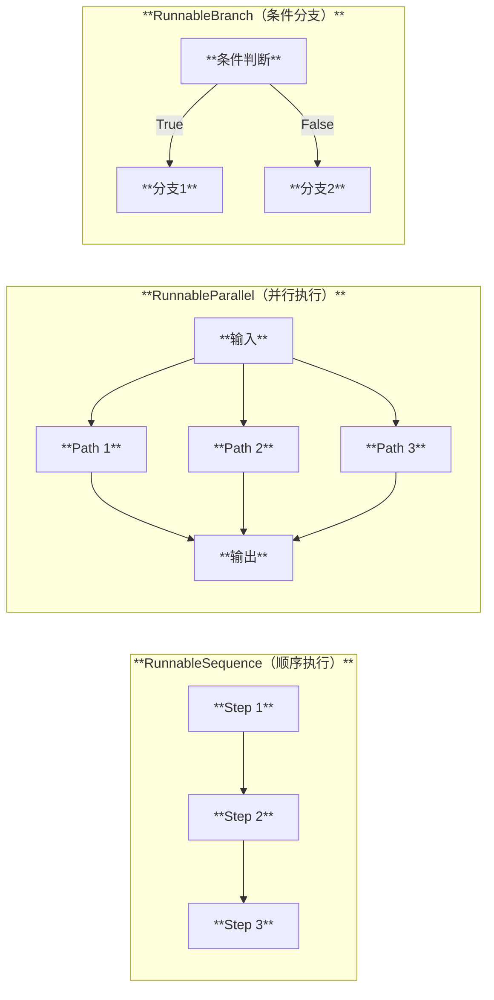

### 3.3 Runnable 的关键子类

| 类名 | 功能 | 使用场景 |
|------|------|----------|
| **RunnableSequence** | 顺序执行多个 Runnable | 构建处理链 |
| **RunnableParallel** | 并行执行多个 Runnable | 同时处理多个任务 |
| **RunnableLambda** | 包装普通函数 | 集成自定义逻辑 |
| **RunnableBranch** | 条件分支执行 | 根据条件选择路径 |
| **RunnablePassthrough** | 透传输入 | 保留原始数据 |
| **RunnableWithFallbacks** | 失败降级 | 提高可靠性 |

## 4. 语言模型抽象

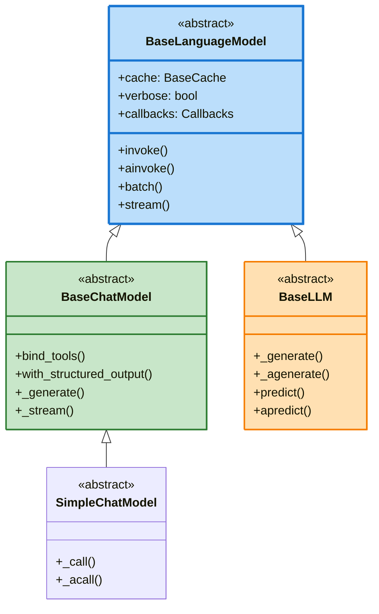

### 4.1 BaseChatModel

Chat 模型使用消息序列作为输入，返回消息作为输出：

**关键方法**：

| 方法 | 输入 | 输出 | 说明 |
|------|------|------|------|
| `invoke` | 消息列表 | AIMessage | 单次调用 |
| `ainvoke` | 消息列表 | AIMessage | 异步调用 |
| `stream` | 消息列表 | Iterator[AIMessageChunk] | 流式输出 |
| `batch` | 多个消息列表 | List[AIMessage] | 批量处理 |
| `bind_tools` | 工具列表 | 新的 ChatModel | 绑定工具 |
| `with_structured_output` | Schema | 新的 Runnable | 结构化输出 |

### 4.2 BaseLLM

传统的文本输入/输出模型：

```python
class BaseLLM(BaseLanguageModel[str], ABC):
    """文本输入输出的语言模型"""

    @abstractmethod
    def _generate(
        self,
        prompts: List[str],
        stop: Optional[List[str]] = None,
        **kwargs: Any,
    ) -> LLMResult:
        """核心生成方法"""
```

## 5. 消息系统

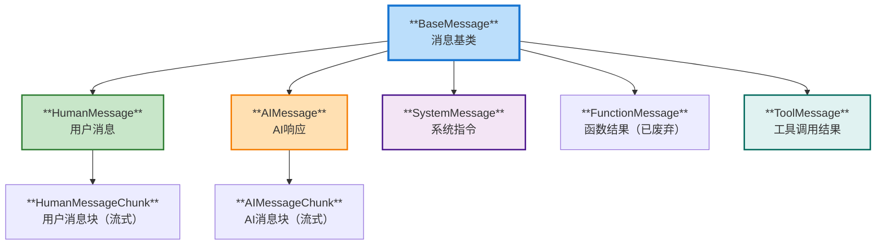

### 消息结构

```python
class BaseMessage(Serializable):
    content: str | List[dict]  # 文本或多模态内容
    additional_kwargs: dict = {}  # 额外参数
    response_metadata: dict = {}  # 响应元数据
    name: Optional[str] = None  # 消息名称
    id: Optional[str] = None  # 消息ID
```

## 6. 提示模板

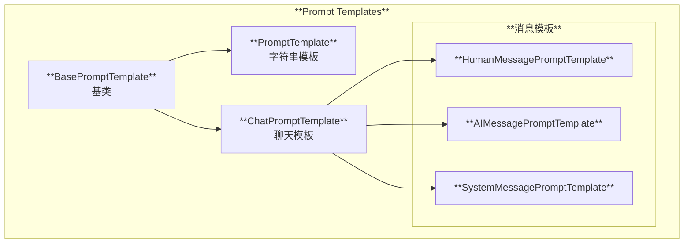

### 6.1 PromptTemplate

用于 LLM 的字符串模板：

```python
from langchain_core.prompts import PromptTemplate

template = PromptTemplate.from_template(
    "请用{language}回答：{question}"
)

formatted = template.invoke({
    "language": "中文",
    "question": "什么是机器学习？"
})
# 输出: "请用中文回答：什么是机器学习？"
```

### 6.2 ChatPromptTemplate

用于 Chat 模型的消息模板：

```python
from langchain_core.prompts import ChatPromptTemplate

template = ChatPromptTemplate.from_messages([
    ("system", "你是一个{role}助手"),
    ("human", "{question}"),
])

messages = template.invoke({
    "role": "编程",
    "question": "如何学习Python？"
})
# 输出: [SystemMessage(...), HumanMessage(...)]
```

## 7. 工具系统

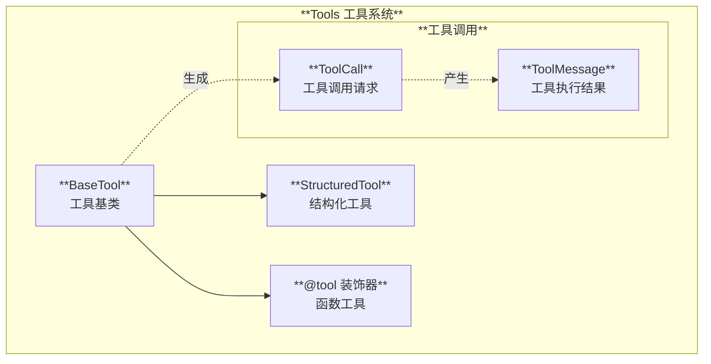

### 7.1 定义工具

使用 `@tool` 装饰器：

```python
from langchain_core.tools import tool

@tool
def search_database(query: str) -> str:
    """在数据库中搜索信息

    Args:
        query: 搜索查询字符串
    """
    # 实现搜索逻辑
    return f"搜索结果: {query}"
```

### 7.2 工具与 Agent 配合

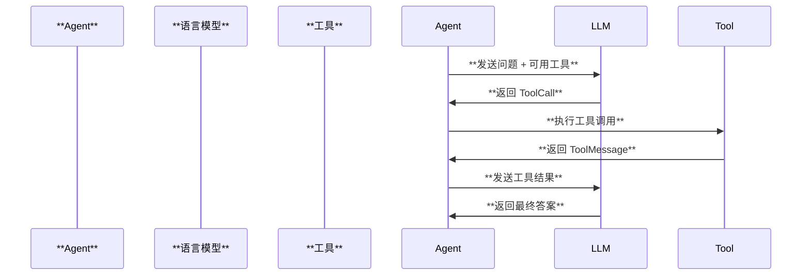

## 8. 输出解析器

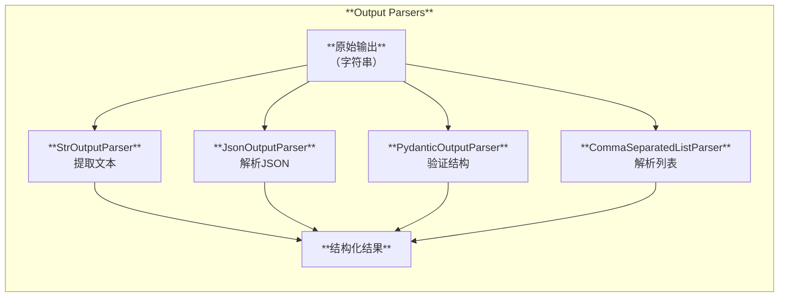

### 常用解析器

| 解析器 | 输入 | 输出 | 用途 |
|--------|------|------|------|
| **StrOutputParser** | AIMessage | str | 提取消息文本内容 |
| **JsonOutputParser** | 包含JSON的字符串 | dict | 解析JSON格式 |
| **PydanticOutputParser** | 结构化文本 | Pydantic Model | 验证和解析结构 |
| **CommaSeparatedListParser** | 逗号分隔文本 | List[str] | 解析列表 |
| **XMLOutputParser** | XML文本 | dict | 解析XML |

## 9. 回调系统

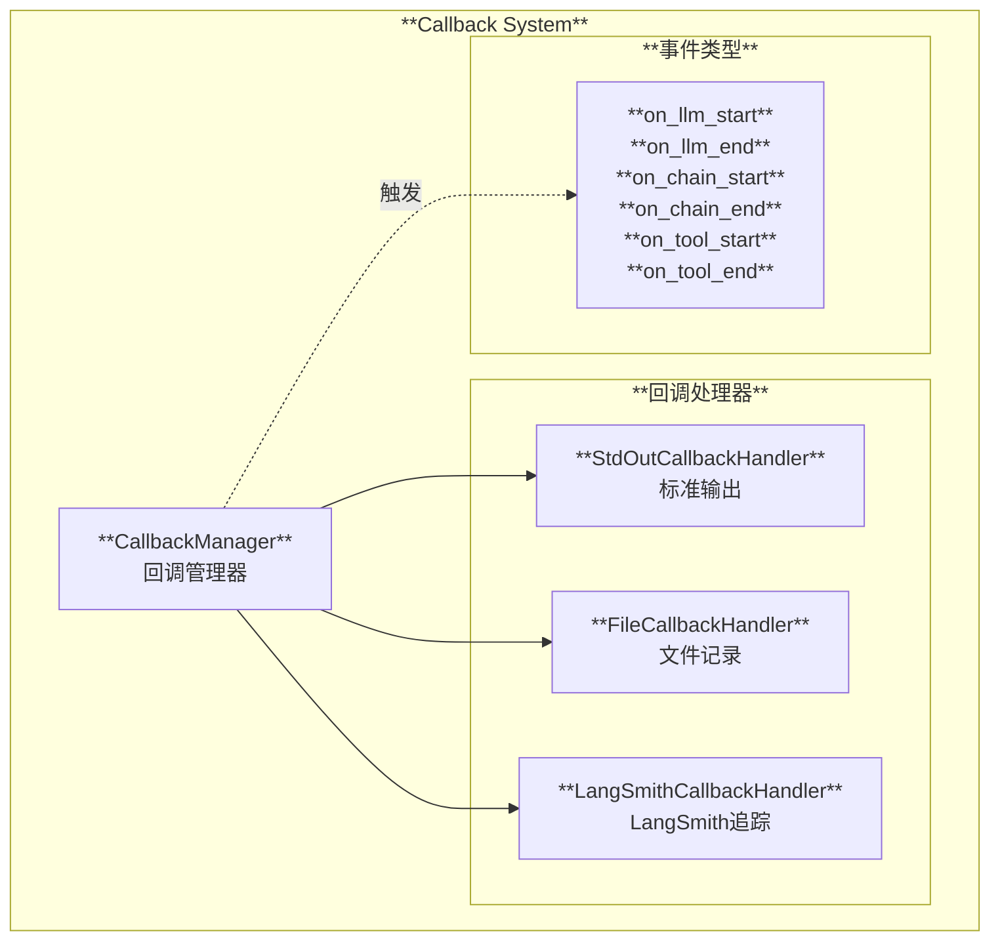

### 9.1 使用回调

```python
from langchain_core.tracers import ConsoleCallbackHandler

# 方法1: 全局设置
from langchain_core.globals import set_debug
set_debug(True)

# 方法2: 在config中指定
chain.invoke(
    input,
    config={"callbacks": [ConsoleCallbackHandler()]}
)
```

### 9.2 自定义回调

```python
from langchain_core.callbacks import BaseCallbackHandler

class MyCallbackHandler(BaseCallbackHandler):
    def on_llm_start(self, serialized, prompts, **kwargs):
        print(f"LLM开始: {prompts}")

    def on_llm_end(self, response, **kwargs):
        print(f"LLM结束: {response}")
```

## 10. 检索器抽象

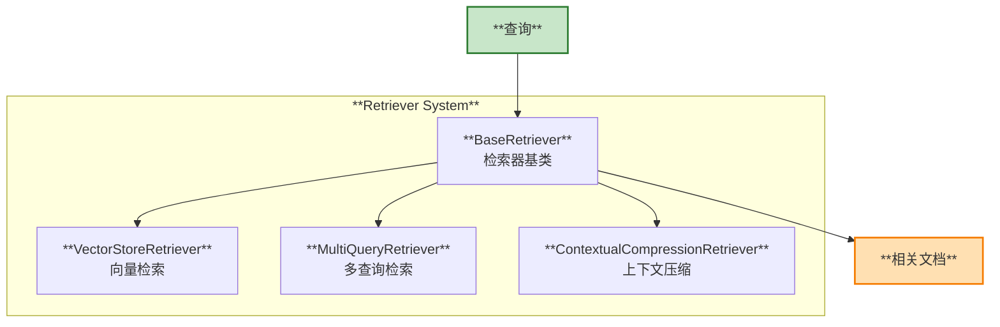

### BaseRetriever 接口

```python
class BaseRetriever(RunnableSerializable[str, List[Document]]):
    """检索器基类"""

    def invoke(self, query: str, config: RunnableConfig = None) -> List[Document]:
        """同步检索"""
        return self._get_relevant_documents(query, config)

    @abstractmethod
    def _get_relevant_documents(
        self, query: str, *, run_manager: CallbackManagerForRetrieverRun
    ) -> List[Document]:
        """实现具体检索逻辑"""
```

## 11. 文档与数据结构

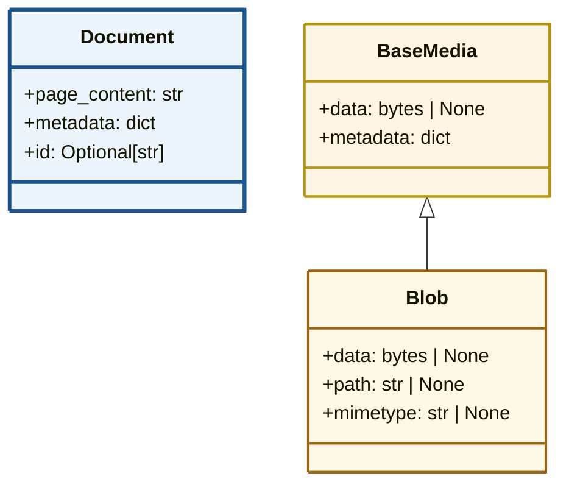

### Document

核心文档数据结构：

```python
from langchain_core.documents import Document

doc = Document(
    page_content="这是文档内容",
    metadata={
        "source": "example.txt",
        "page": 1,
        "author": "张三"
    }
)
```

## 12. 核心组件总结

| 组件 | 作用 | 关键类 |
|------|------|--------|
| **Runnable** | 统一执行接口 | `Runnable`, `RunnableSequence` |
| **Language Models** | 语言模型抽象 | `BaseChatModel`, `BaseLLM` |
| **Messages** | 消息类型定义 | `HumanMessage`, `AIMessage` |
| **Prompts** | 提示模板 | `PromptTemplate`, `ChatPromptTemplate` |
| **Tools** | 工具系统 | `BaseTool`, `@tool` |
| **Output Parsers** | 输出解析 | `StrOutputParser`, `JsonOutputParser` |
| **Callbacks** | 回调监控 | `CallbackManager`, `BaseCallbackHandler` |
| **Retrievers** | 检索抽象 | `BaseRetriever` |
| **Documents** | 文档结构 | `Document` |

## 13. 下一步

- [运行原理与流程](./03-运行原理与流程.md) - 深入理解执行机制
- [使用场景与案例](./04-使用场景与案例.md) - 实际应用示例
- [集成开发指南](./05-集成开发指南.md) - 如何开发自定义集成

---

**文档版本**: 1.0
**最后更新**: 2025-11-22

