# LangChain 运行原理与流程

## 1. 概述

本文档深入解析 LangChain 的执行机制，包括链式调用、流式处理、批量处理等核心流程。

## 2. 基础执行流程

### 2.1 单次调用（invoke）

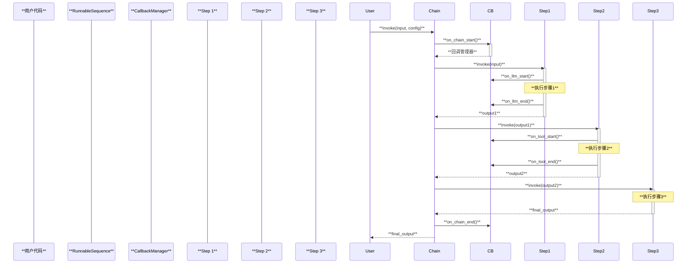

### 2.2 执行流程代码解析

```python
# RunnableSequence.invoke 的核心逻辑
def invoke(self, input: Input, config: RunnableConfig | None = None) -> Output:
    # 1. 设置回调和上下文
    config = ensure_config(config)
    callback_manager = get_callback_manager_for_config(config)

    # 2. 启动根运行
    run_manager = callback_manager.on_chain_start(
        None,
        input,
        name=self.get_name(),
    )

    input_ = input

    # 3. 依次调用每个步骤
    try:
        for i, step in enumerate(self.steps):
            # 为每个步骤创建子运行
            config = patch_config(
                config,
                callbacks=run_manager.get_child(f"seq:step:{i + 1}")
            )
            # 执行步骤
            input_ = step.invoke(input_, config)

    # 4. 完成运行
    except BaseException as e:
        run_manager.on_chain_error(e)
        raise
    else:
        run_manager.on_chain_end(input_)
        return input_
```

## 3. 流式处理原理

### 3.1 流式处理时序图

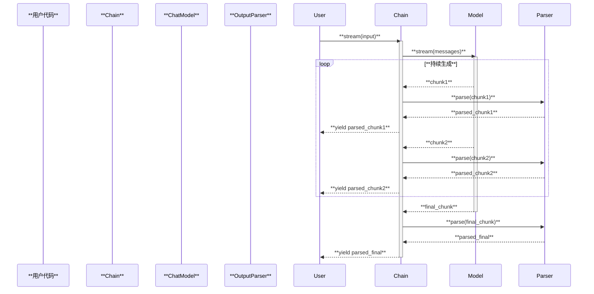

### 3.2 流式处理的实现

```python
def stream(self, input: Input, config: RunnableConfig = None) -> Iterator[Output]:
    """流式输出实现"""

    # 设置回调
    config = ensure_config(config)
    callback_manager = get_callback_manager_for_config(config)

    # 启动流式处理
    run_manager = callback_manager.on_chain_start(
        None, input, name=self.get_name()
    )

    try:
        # 逐步处理每个组件
        for i, step in enumerate(self.steps[:-1]):
            # 非流式步骤：完整执行
            input = step.invoke(input, config)

        # 最后一个步骤：流式输出
        final_step = self.steps[-1]
        for chunk in final_step.stream(input, config):
            yield chunk

    except BaseException as e:
        run_manager.on_chain_error(e)
        raise
    else:
        run_manager.on_chain_end(None)
```

### 3.3 流式处理的优势

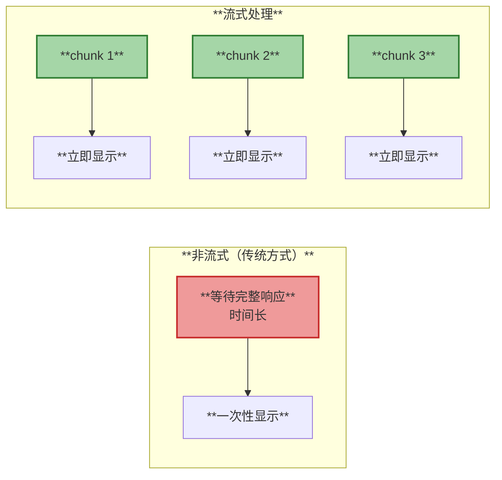

**优势**：
- ✅ 更快的首字节时间（TTFB）
- ✅ 更好的用户体验
- ✅ 降低感知延迟
- ✅ 支持实时交互

## 4. 批量处理机制

### 4.1 批量处理时序图

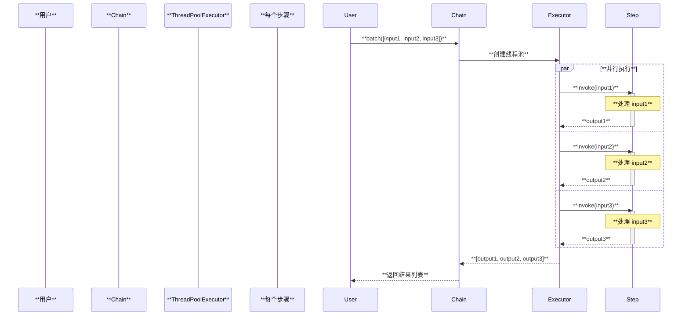

### 4.2 批量处理的实现

```python
def batch(
    self,
    inputs: List[Input],
    config: RunnableConfig | List[RunnableConfig] = None,
    *,
    max_concurrency: Optional[int] = None,
) -> List[Output]:
    """批量处理多个输入"""

    # 获取配置列表
    configs = get_config_list(config, len(inputs))

    # 获取执行器（线程池）
    with get_executor_for_config(configs[0]) as executor:
        # 提交所有任务
        futures = [
            executor.submit(self.invoke, input, config)
            for input, config in zip(inputs, configs)
        ]

        # 等待所有任务完成
        results = [future.result() for future in futures]

    return results
```

### 4.3 批量处理优化

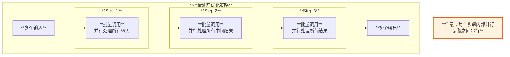

## 5. LCEL 组合执行

### 5.1 顺序组合（Sequence）

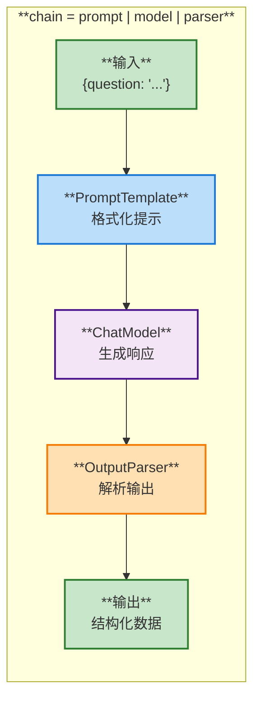

**执行流程**：

```python
# 定义链
chain = prompt | model | parser

# 执行
result = chain.invoke({"question": "什么是机器学习？"})

# 内部执行：
# 1. formatted = prompt.invoke({"question": "..."})
# 2. response = model.invoke(formatted)
# 3. result = parser.invoke(response)
```

### 5.2 并行组合（Parallel）

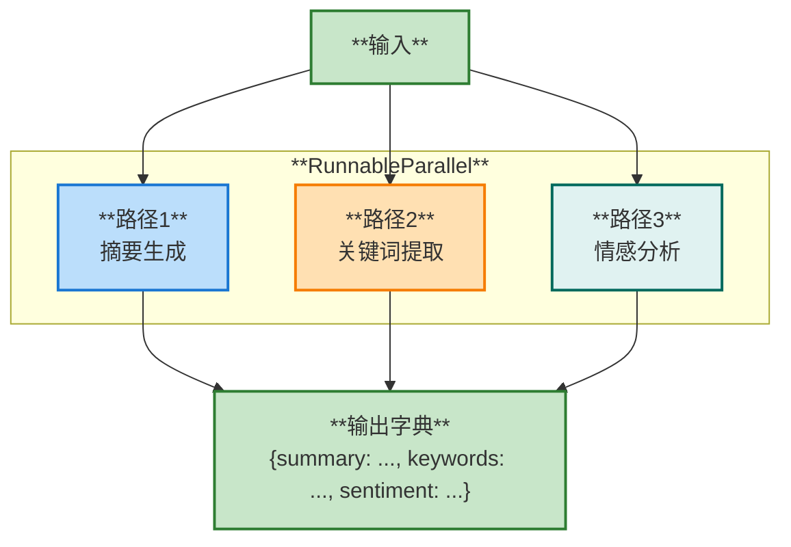

**执行代码**：

```python
# 定义并行链
chain = {
    "summary": prompt1 | model,
    "keywords": prompt2 | model,
    "sentiment": prompt3 | model,
}

# 执行（所有路径并行）
result = chain.invoke({"text": "文章内容..."})
# 结果: {"summary": "...", "keywords": "...", "sentiment": "..."}
```

### 5.3 条件分支（Branch）

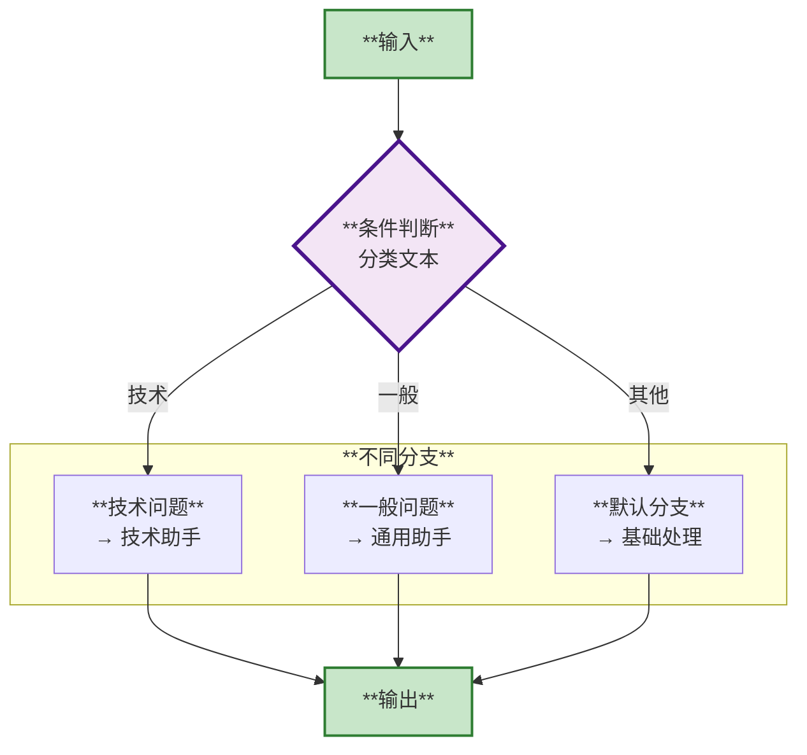

## 6. Agent 执行循环

### 6.1 Agent 工作流程

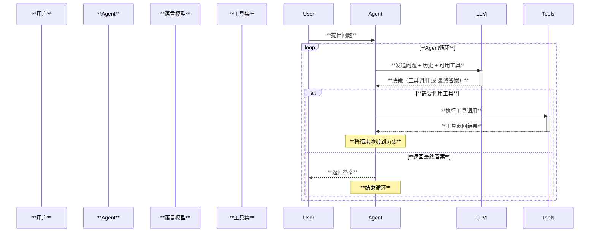

### 6.2 Agent 执行详细流程

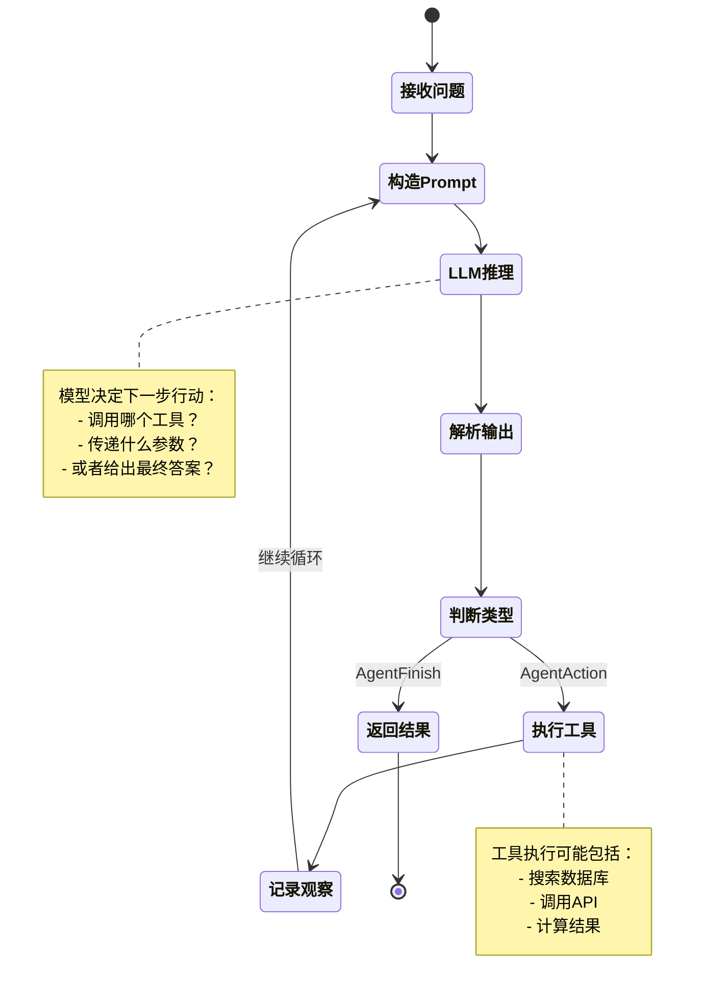

### 6.3 Agent 循环示例

```python
# 简化的 Agent 执行逻辑
def run_agent(question: str, tools: List[Tool], max_iterations: int = 10):
    """Agent 执行循环"""

    history = []

    for i in range(max_iterations):
        # 1. 构造提示（包含问题、历史、可用工具）
        prompt = build_prompt(question, history, tools)

        # 2. LLM 推理
        response = llm.invoke(prompt)

        # 3. 解析输出
        action = parse_agent_output(response)

        # 4. 判断类型
        if isinstance(action, AgentFinish):
            # 返回最终答案
            return action.return_values

        elif isinstance(action, AgentAction):
            # 执行工具
            tool = get_tool(action.tool)
            observation = tool.invoke(action.tool_input)

            # 记录到历史
            history.append({
                "action": action,
                "observation": observation
            })

    raise ValueError("超过最大迭代次数")
```

## 7. 回调系统执行流程

### 7.1 回调触发时机

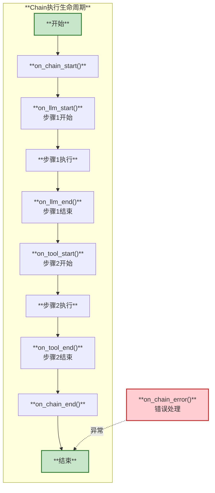

### 7.2 回调传播机制

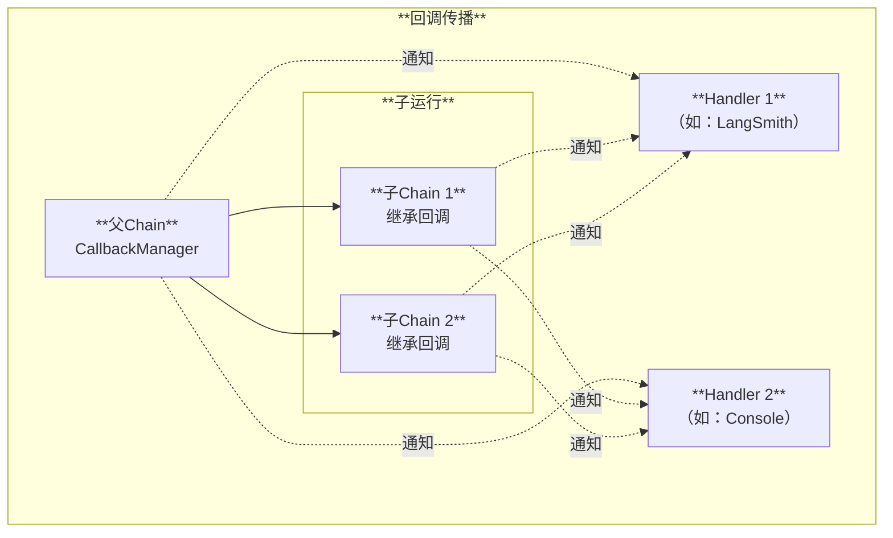

## 8. 错误处理与重试

### 8.1 重试机制

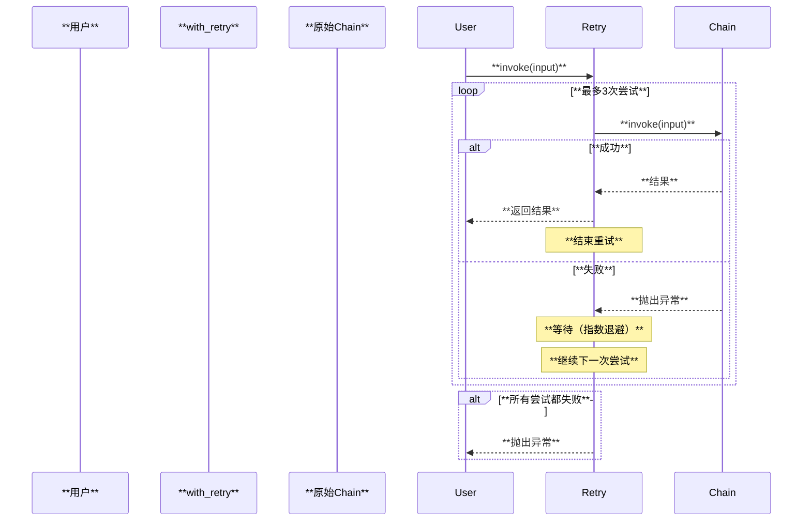

### 8.2 降级处理（Fallback）

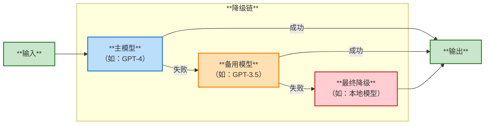

**代码示例**：

```python
# 重试
chain_with_retry = chain.with_retry(
    stop_after_attempt=3,
    wait_exponential_jitter=True
)

# 降级
chain_with_fallback = primary_model.with_fallbacks([
    backup_model_1,
    backup_model_2
])
```

## 9. 性能优化策略

### 9.1 执行优化

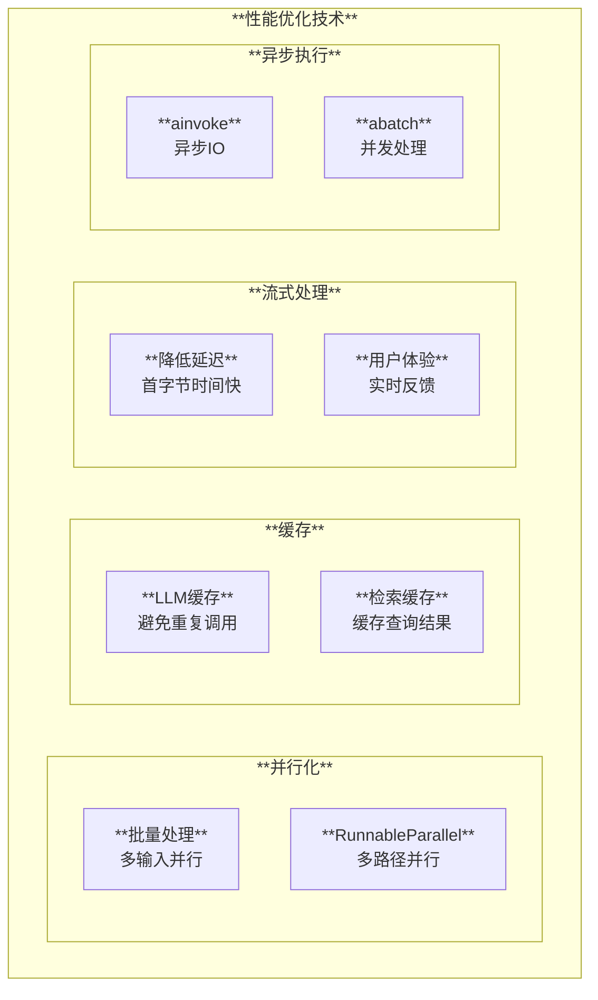

### 9.2 优化建议

| 场景 | 优化方案 | 提升效果 |
|------|----------|----------|
| **多个独立任务** | 使用 `RunnableParallel` | 减少总时间 |
| **批量请求** | 使用 `batch()` 方法 | 并行处理 |
| **重复请求** | 启用 LLM 缓存 | 避免重复调用 |
| **长时间生成** | 使用流式输出 | 降低感知延迟 |
| **IO密集型** | 使用异步方法 | 提高吞吐量 |
| **可能失败** | 配置重试和降级 | 提高可靠性 |

## 10. 调试与监控

### 10.1 调试流程

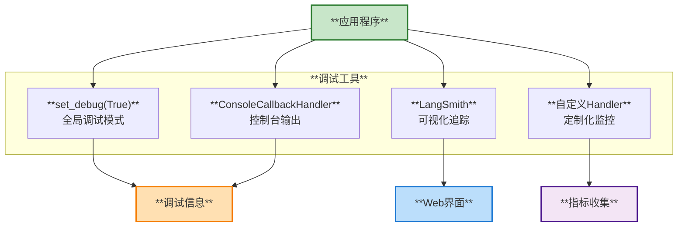

### 10.2 监控指标

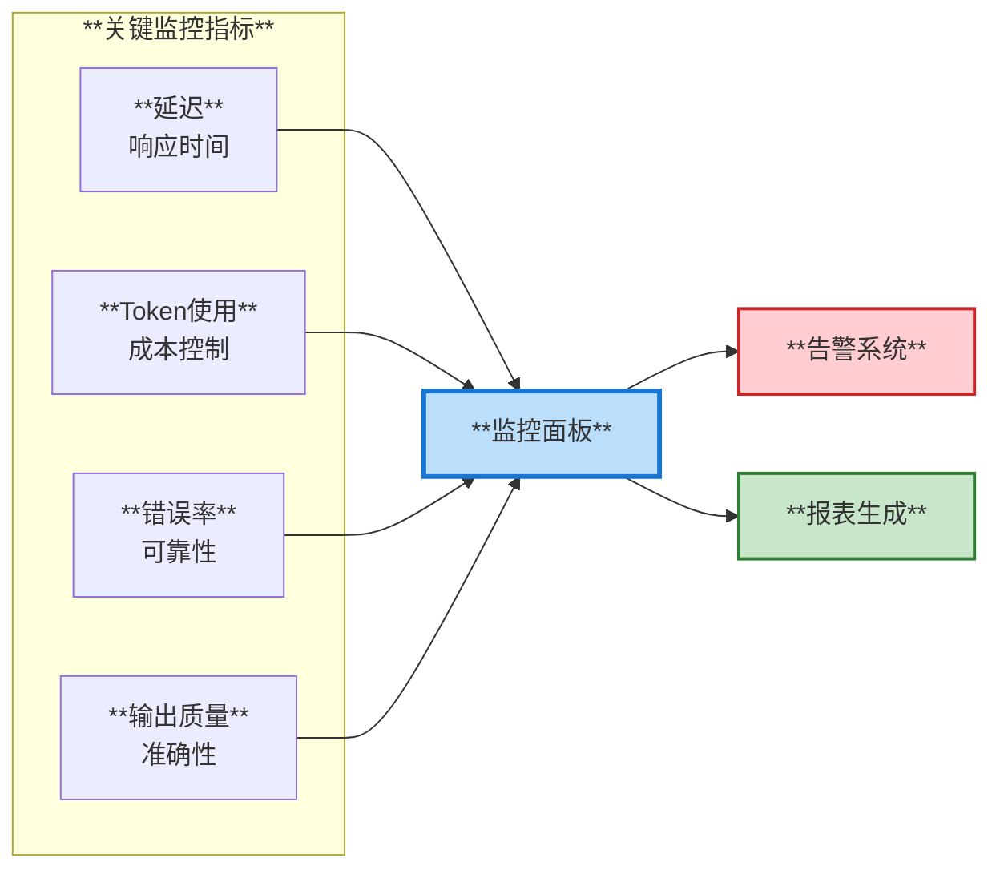

## 11. 总结

### 核心执行模式

| 模式 | 适用场景 | 特点 |
|------|----------|------|
| **invoke** | 单次调用 | 简单直接 |
| **batch** | 批量处理 | 并行优化 |
| **stream** | 实时交互 | 降低延迟 |
| **ainvoke** | 异步IO | 高并发 |

### 关键设计

1. **统一接口**：所有组件实现 Runnable
2. **组合优先**：使用 `|` 操作符组合
3. **回调系统**：完整的生命周期监控
4. **错误处理**：重试、降级机制
5. **性能优化**：并行、缓存、流式

## 12. 下一步

- [使用场景与案例](./04-使用场景与案例.md) - 实际应用示例
- [集成开发指南](./05-集成开发指南.md) - 开发自定义集成

---

**文档版本**: 1.0
**最后更新**: 2025-11-22

