# LangChain 使用场景与案例

## 1. 概述

LangChain 适用于多种 AI 应用场景，本文档详细介绍各种典型使用场景及其实现方案。

## 2. 主要应用场景

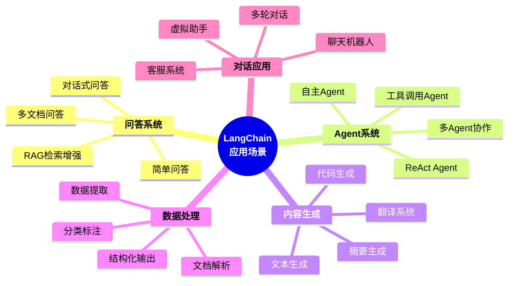

## 3. 场景一：RAG（检索增强生成）

### 3.1 架构图

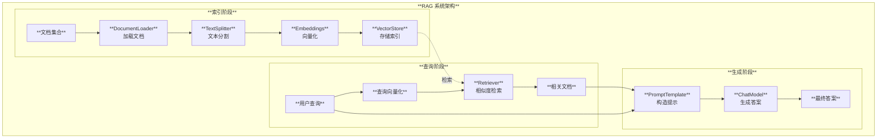

### 3.2 实现代码

```python
from langchain_community.document_loaders import TextLoader
from langchain_text_splitters import RecursiveCharacterTextSplitter
from langchain_openai import OpenAIEmbeddings, ChatOpenAI
from langchain_chroma import Chroma
from langchain_core.prompts import ChatPromptTemplate
from langchain_core.runnables import RunnablePassthrough
from langchain_core.output_parsers import StrOutputParser

# 1. 加载文档
loader = TextLoader("document.txt")
documents = loader.load()

# 2. 分割文档
text_splitter = RecursiveCharacterTextSplitter(
    chunk_size=1000,
    chunk_overlap=200
)
splits = text_splitter.split_documents(documents)

# 3. 创建向量存储
embeddings = OpenAIEmbeddings()
vectorstore = Chroma.from_documents(
    documents=splits,
    embedding=embeddings
)

# 4. 创建检索器
retriever = vectorstore.as_retriever(
    search_kwargs={"k": 3}
)

# 5. 定义提示模板
template = """基于以下上下文回答问题：

上下文：{context}

问题：{question}

回答："""

prompt = ChatPromptTemplate.from_template(template)

# 6. 构建 RAG 链
rag_chain = (
    {
        "context": retriever,
        "question": RunnablePassthrough()
    }
    | prompt
    | ChatOpenAI(model="gpt-4")
    | StrOutputParser()
)

# 7. 使用
answer = rag_chain.invoke("什么是 LangChain？")
print(answer)
```

### 3.3 RAG 工作流程

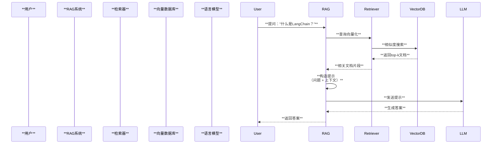

## 4. 场景二：Agent 工具调用

### 4.1 Agent 架构

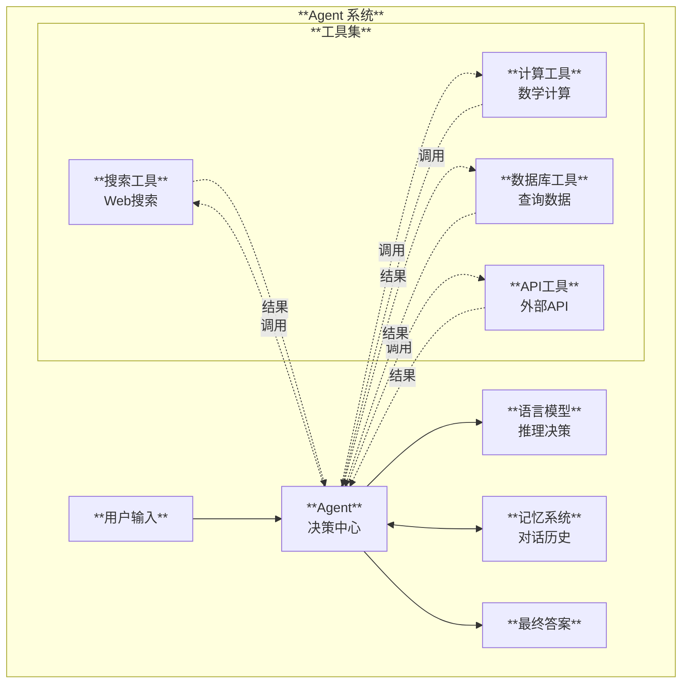

### 4.2 实现代码

```python
from langchain import hub
from langchain.agents import create_tool_calling_agent, AgentExecutor
from langchain_openai import ChatOpenAI
from langchain_core.tools import tool

# 1. 定义工具
@tool
def search_database(query: str) -> str:
    """在数据库中搜索信息

    Args:
        query: 搜索查询
    """
    # 实现搜索逻辑
    return f"搜索结果: {query}"

@tool
def calculate(expression: str) -> str:
    """计算数学表达式

    Args:
        expression: 数学表达式
    """
    try:
        result = eval(expression)
        return f"计算结果: {result}"
    except Exception as e:
        return f"计算错误: {e}"

# 2. 创建工具列表
tools = [search_database, calculate]

# 3. 获取提示模板
prompt = hub.pull("hwchase17/openai-tools-agent")

# 4. 创建 Agent
llm = ChatOpenAI(model="gpt-4", temperature=0)
agent = create_tool_calling_agent(llm, tools, prompt)

# 5. 创建 Agent 执行器
agent_executor = AgentExecutor(
    agent=agent,
    tools=tools,
    verbose=True
)

# 6. 使用
result = agent_executor.invoke({
    "input": "帮我计算 25 * 4，然后在数据库中搜索结果"
})
print(result["output"])
```

### 4.3 Agent 执行流程

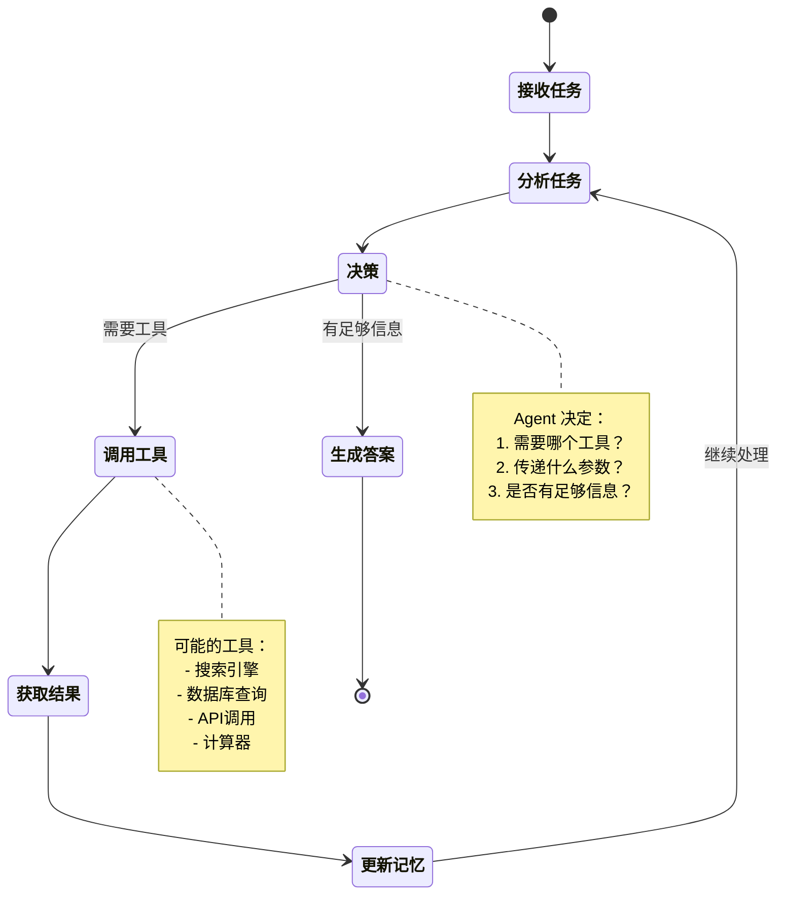

## 5. 场景三：对话式聊天机器人

### 5.1 对话系统架构

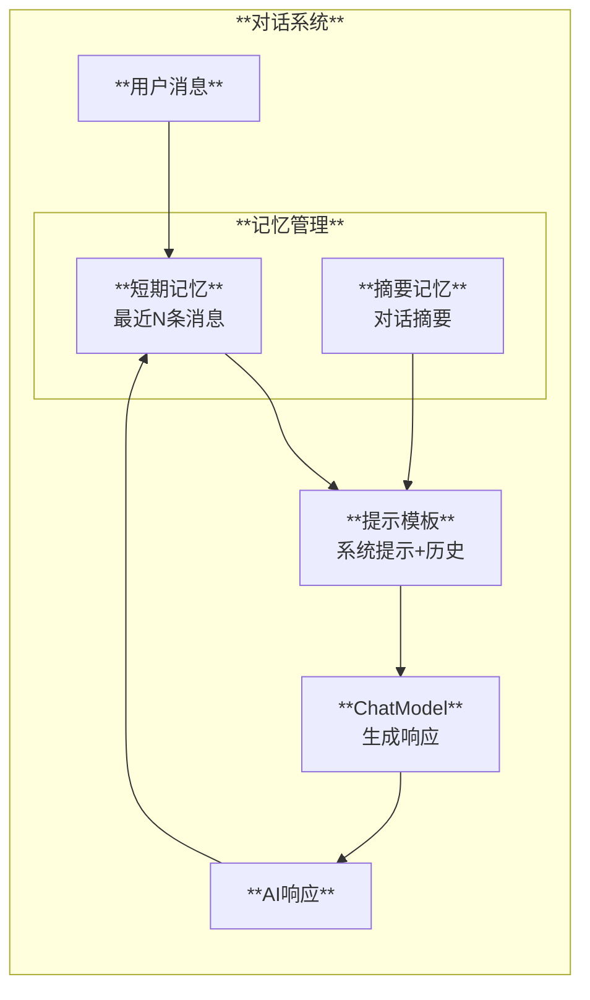

### 5.2 实现代码

```python
from langchain_openai import ChatOpenAI
from langchain_core.prompts import ChatPromptTemplate, MessagesPlaceholder
from langchain_core.runnables.history import RunnableWithMessageHistory
from langchain_community.chat_message_histories import ChatMessageHistory

# 1. 定义提示模板
prompt = ChatPromptTemplate.from_messages([
    ("system", "你是一个友好的助手，名字叫小智。"),
    MessagesPlaceholder(variable_name="history"),
    ("human", "{input}")
])

# 2. 创建模型
model = ChatOpenAI(model="gpt-4")

# 3. 构建链
chain = prompt | model

# 4. 创建记忆存储
store = {}

def get_session_history(session_id: str):
    if session_id not in store:
        store[session_id] = ChatMessageHistory()
    return store[session_id]

# 5. 添加记忆支持
chain_with_history = RunnableWithMessageHistory(
    chain,
    get_session_history,
    input_messages_key="input",
    history_messages_key="history"
)

# 6. 使用（带会话ID）
response = chain_with_history.invoke(
    {"input": "你好，我是张三"},
    config={"configurable": {"session_id": "user_001"}}
)
print(response.content)

response = chain_with_history.invoke(
    {"input": "我叫什么名字？"},
    config={"configurable": {"session_id": "user_001"}}
)
print(response.content)  # 能记住之前说的"张三"
```

### 5.3 对话流程

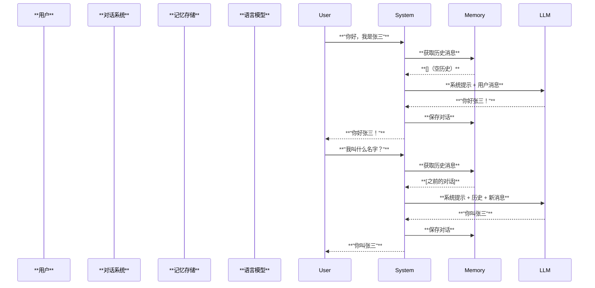

## 6. 场景四：结构化数据提取

### 6.1 数据提取流程

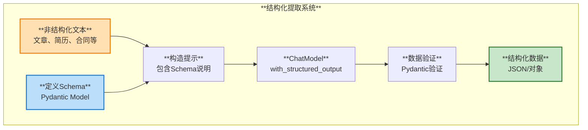

### 6.2 实现代码

```python
from langchain_openai import ChatOpenAI
from langchain_core.prompts import ChatPromptTemplate
from pydantic import BaseModel, Field
from typing import List

# 1. 定义数据结构
class Person(BaseModel):
    """人物信息"""
    name: str = Field(description="姓名")
    age: int = Field(description="年龄")
    skills: List[str] = Field(description="技能列表")
    experience: str = Field(description="工作经验")

# 2. 创建模型（支持结构化输出）
llm = ChatOpenAI(model="gpt-4", temperature=0)

# 3. 配置结构化输出
structured_llm = llm.with_structured_output(Person)

# 4. 定义提示
prompt = ChatPromptTemplate.from_messages([
    ("system", "从文本中提取人物信息"),
    ("human", "{text}")
])

# 5. 构建链
extraction_chain = prompt | structured_llm

# 6. 使用
text = """
张三，28岁，是一名资深的Python开发工程师。
他精通Python、Django和FastAPI框架，
有5年的Web开发经验。
"""

result = extraction_chain.invoke({"text": text})
print(result)
# Person(name='张三', age=28, skills=['Python', 'Django', 'FastAPI'],
#        experience='5年的Web开发经验')
```

### 6.3 应用场景

| 场景 | 输入 | 输出 | 用途 |
|------|------|------|------|
| **简历解析** | 简历文本 | 结构化人才信息 | HR系统 |
| **合同分析** | 合同文档 | 关键条款提取 | 法务审核 |
| **客户分析** | 客户反馈 | 情感+关键点 | CRM系统 |
| **文章分析** | 新闻文章 | 摘要+关键词+实体 | 内容管理 |

## 7. 场景五：多文档问答系统

### 7.1 系统架构

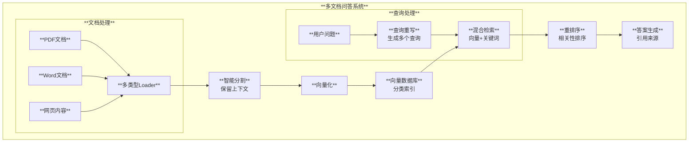

### 7.2 实现代码

```python
from langchain_community.document_loaders import (
    PyPDFLoader,
    Docx2txtLoader,
    WebBaseLoader
)
from langchain_text_splitters import RecursiveCharacterTextSplitter
from langchain_openai import OpenAIEmbeddings, ChatOpenAI
from langchain_chroma import Chroma
from langchain.retrievers import ContextualCompressionRetriever
from langchain.retrievers.document_compressors import LLMChainExtractor

# 1. 加载多种文档
pdf_loader = PyPDFLoader("document.pdf")
docx_loader = Docx2txtLoader("document.docx")
web_loader = WebBaseLoader("https://example.com")

documents = []
documents.extend(pdf_loader.load())
documents.extend(docx_loader.load())
documents.extend(web_loader.load())

# 2. 分割文档
splitter = RecursiveCharacterTextSplitter(
    chunk_size=1000,
    chunk_overlap=200,
    separators=["\n\n", "\n", "。", "！", "？", "，", " ", ""]
)
splits = splitter.split_documents(documents)

# 3. 创建向量存储
vectorstore = Chroma.from_documents(
    documents=splits,
    embedding=OpenAIEmbeddings(),
    collection_name="multi_docs"
)

# 4. 创建基础检索器
base_retriever = vectorstore.as_retriever(search_kwargs={"k": 10})

# 5. 添加压缩（重排序）
llm = ChatOpenAI(model="gpt-4", temperature=0)
compressor = LLMChainExtractor.from_llm(llm)

compression_retriever = ContextualCompressionRetriever(
    base_compressor=compressor,
    base_retriever=base_retriever
)

# 6. 构建问答链
from langchain.chains import RetrievalQA

qa_chain = RetrievalQA.from_chain_type(
    llm=llm,
    chain_type="stuff",
    retriever=compression_retriever,
    return_source_documents=True
)

# 7. 使用
result = qa_chain.invoke({"query": "文档中提到了哪些关键技术？"})
print("答案:", result["result"])
print("\n来源:")
for doc in result["source_documents"]:
    print(f"- {doc.metadata['source']}")
```

## 8. 场景六：代码助手

### 8.1 代码助手架构

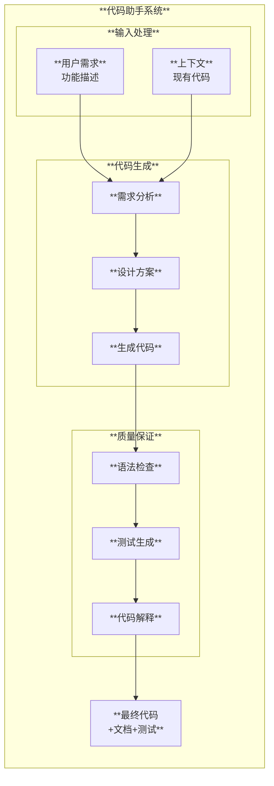

### 8.2 实现示例

```python
from langchain_openai import ChatOpenAI
from langchain_core.prompts import ChatPromptTemplate
from langchain_core.output_parsers import StrOutputParser

# 1. 定义提示模板
code_gen_template = """你是一个专业的Python开发助手。

任务：{task}

要求：
1. 编写清晰、可维护的代码
2. 添加详细的文档字符串
3. 包含类型提示
4. 提供使用示例

代码："""

prompt = ChatPromptTemplate.from_template(code_gen_template)

# 2. 创建代码生成链
llm = ChatOpenAI(model="gpt-4", temperature=0)
code_chain = prompt | llm | StrOutputParser()

# 3. 使用
task = "创建一个用户认证系统，支持注册、登录和权限验证"
code = code_chain.invoke({"task": task})
print(code)
```

## 9. 场景对比与选择

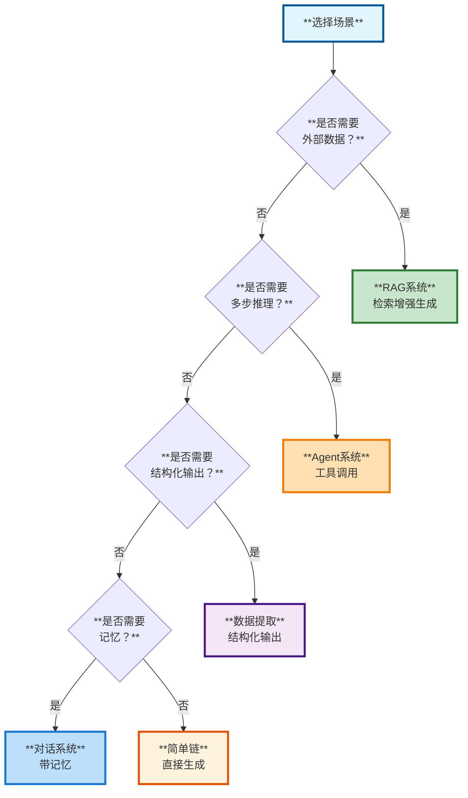

## 10. 最佳实践

### 10.1 性能优化

| 优化点 | 方案 | 效果 |
|--------|------|------|
| **并行处理** | 使用 RunnableParallel | 减少延迟 |
| **缓存** | 启用 LLM 缓存 | 降低成本 |
| **批处理** | batch() 方法 | 提高吞吐 |
| **流式输出** | stream() 方法 | 改善体验 |
| **索引优化** | 合理的 chunk_size | 提高检索质量 |

### 10.2 成本控制

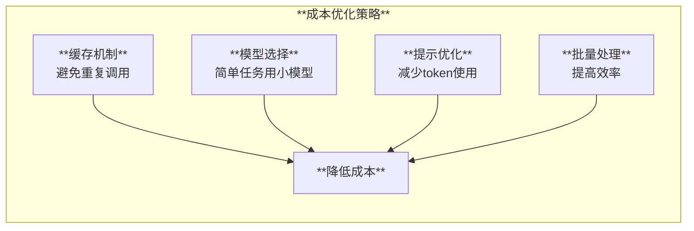

### 10.3 质量提升

1. **提示工程**：精心设计提示模板
2. **Few-shot 学习**：提供示例
3. **输出验证**：使用 Pydantic 验证
4. **错误处理**：重试和降级策略
5. **评估优化**：持续评估和改进

## 11. 生产部署建议

### 11.1 部署架构

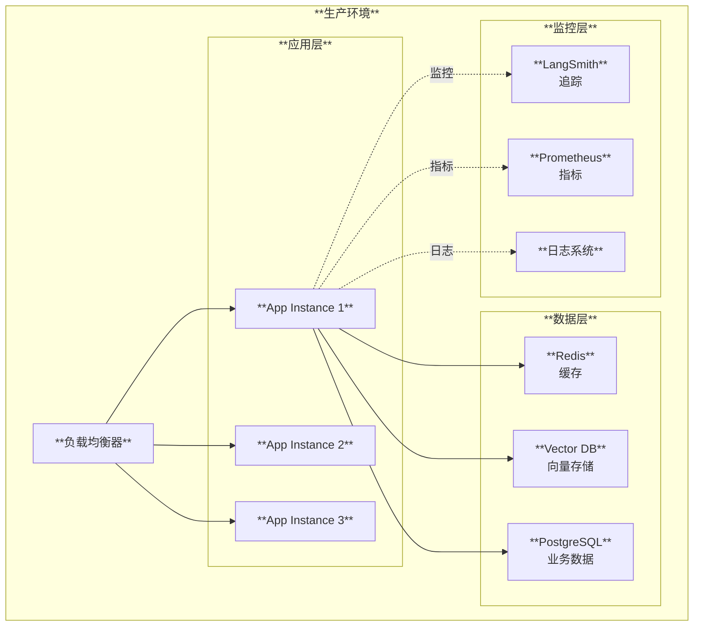

### 11.2 关键考虑

- ✅ **可扩展性**：水平扩展能力
- ✅ **可靠性**：错误处理和降级
- ✅ **监控**：完整的监控体系
- ✅ **安全**：API密钥管理
- ✅ **成本**：资源优化和缓存

## 12. 总结

本文档介绍了 LangChain 的主要应用场景：

1. **RAG 系统**：知识库问答
2. **Agent 系统**：智能助手
3. **对话机器人**：多轮对话
4. **数据提取**：结构化输出
5. **多文档问答**：企业知识库
6. **代码助手**：开发辅助

选择合适的场景和架构模式，能够快速构建高质量的 AI 应用。

## 13. 下一步

- [集成开发指南](./05-集成开发指南.md) - 如何开发自定义集成
- [总览文档](./00-总览.md) - 返回总览

---

**文档版本**: 1.0
**最后更新**: 2025-11-22

