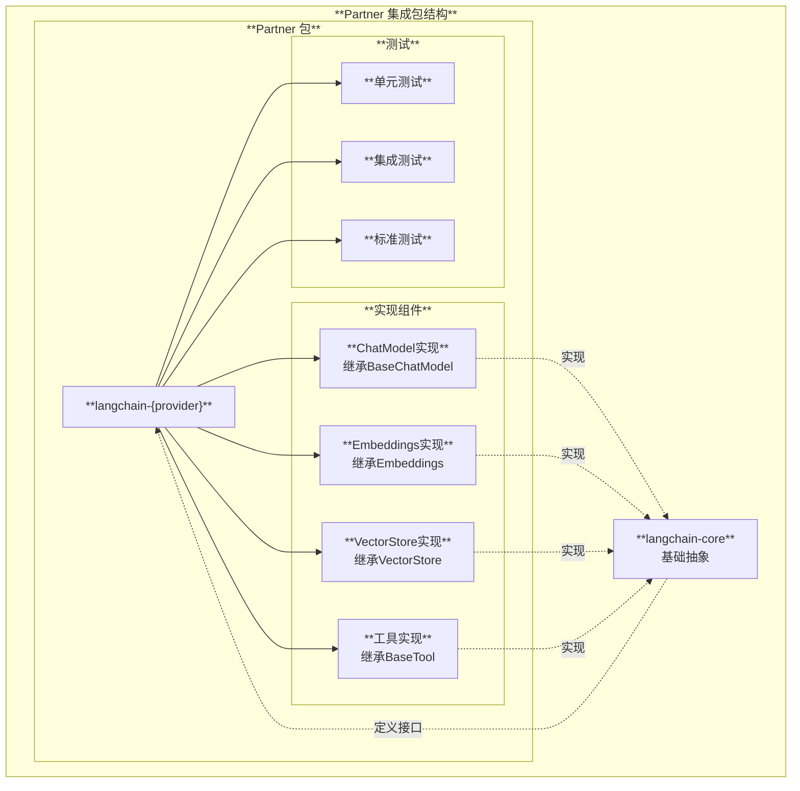
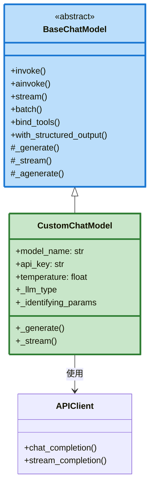
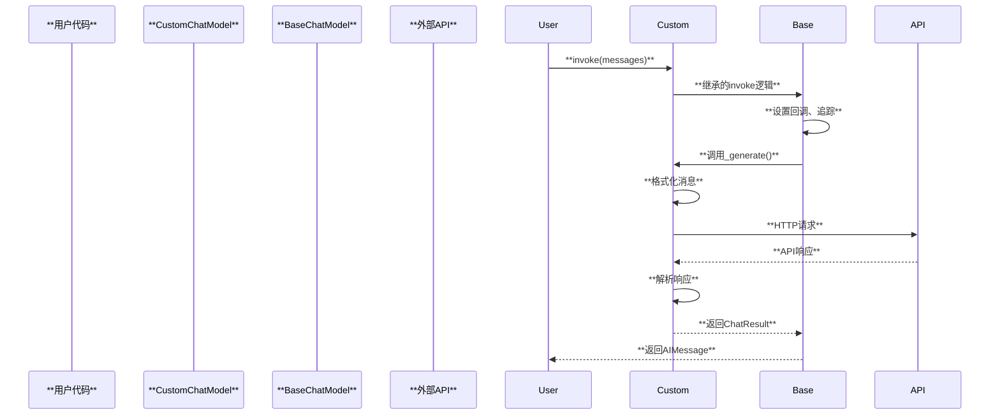
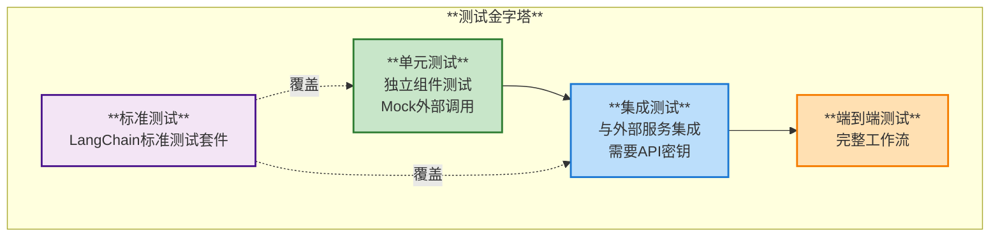
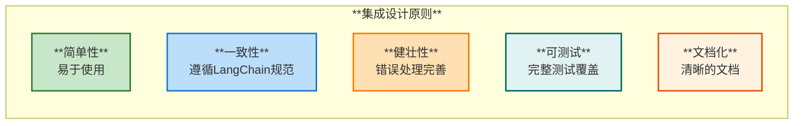
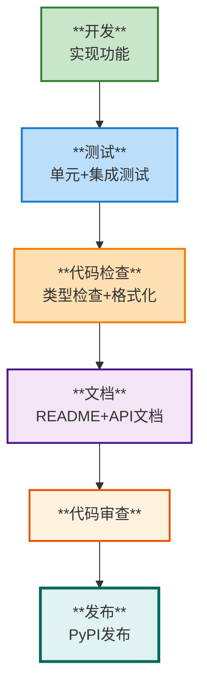

# LangChain 集成开发指南

## 1. 概述

本文档介绍如何为 LangChain 开发第三方集成，包括模型集成、工具集成、向量存储集成等。

## 2. 集成包结构

### 2.1 Partner 包架构



### 2.2 标准目录结构

```
langchain-{provider}/
├── langchain_{provider}/
│   ├── __init__.py              # 导出公共API
│   ├── chat_models.py           # Chat模型实现
│   ├── llms.py                  # LLM实现
│   ├── embeddings.py            # 嵌入实现
│   ├── vectorstores.py          # 向量存储实现
│   ├── tools/                   # 工具实现
│   │   └── __init__.py
│   └── py.typed                 # 类型标记文件
├── tests/
│   ├── unit_tests/              # 单元测试
│   ├── integration_tests/       # 集成测试
│   └── __init__.py
├── pyproject.toml               # 项目配置
├── README.md                    # 文档
├── LICENSE                      # 许可证
└── Makefile                     # 开发任务
```

## 3. 开发 ChatModel 集成

### 3.1 实现架构



### 3.2 实现代码模板

```python
from typing import Any, AsyncIterator, Dict, Iterator, List, Optional
from langchain_core.language_models.chat_models import BaseChatModel
from langchain_core.messages import BaseMessage, AIMessage, AIMessageChunk
from langchain_core.outputs import ChatGeneration, ChatGenerationChunk, ChatResult
from langchain_core.callbacks import CallbackManagerForLLMRun, AsyncCallbackManagerForLLMRun
from pydantic import Field, SecretStr

class CustomChatModel(BaseChatModel):
    """自定义 Chat 模型集成

    示例:
        ```python
        from langchain_custom import CustomChatModel

        model = CustomChatModel(
            api_key="your-api-key",
            model_name="custom-model",
            temperature=0.7
        )

        response = model.invoke([
            {"role": "user", "content": "Hello!"}
        ])
        ```
    """

    # 1. 定义参数
    model_name: str = Field(default="default-model", description="模型名称")
    api_key: SecretStr = Field(description="API密钥")
    temperature: float = Field(default=0.7, ge=0, le=2, description="温度参数")
    max_tokens: Optional[int] = Field(default=None, description="最大token数")

    # 2. 实现必需属性
    @property
    def _llm_type(self) -> str:
        """返回模型类型标识"""
        return "custom-chat"

    @property
    def _identifying_params(self) -> Dict[str, Any]:
        """返回用于追踪的参数"""
        return {
            "model_name": self.model_name,
            "temperature": self.temperature,
            "max_tokens": self.max_tokens,
        }

    # 3. 实现核心生成方法
    def _generate(
        self,
        messages: List[BaseMessage],
        stop: Optional[List[str]] = None,
        run_manager: Optional[CallbackManagerForLLMRun] = None,
        **kwargs: Any,
    ) -> ChatResult:
        """同步生成方法（必需）

        Args:
            messages: 输入消息列表
            stop: 停止词列表
            run_manager: 回调管理器
            **kwargs: 额外参数

        Returns:
            ChatResult: 生成结果
        """
        # 1. 转换消息格式
        formatted_messages = self._format_messages(messages)

        # 2. 调用API
        response = self._call_api(
            messages=formatted_messages,
            stop=stop,
            **kwargs
        )

        # 3. 解析响应
        message = AIMessage(content=response["content"])
        generation = ChatGeneration(message=message)

        # 4. 返回结果
        return ChatResult(
            generations=[generation],
            llm_output=response.get("metadata", {})
        )

    # 4. 实现流式方法（可选但推荐）
    def _stream(
        self,
        messages: List[BaseMessage],
        stop: Optional[List[str]] = None,
        run_manager: Optional[CallbackManagerForLLMRun] = None,
        **kwargs: Any,
    ) -> Iterator[ChatGenerationChunk]:
        """流式生成方法

        Args:
            messages: 输入消息列表
            stop: 停止词列表
            run_manager: 回调管理器
            **kwargs: 额外参数

        Yields:
            ChatGenerationChunk: 生成的文本块
        """
        formatted_messages = self._format_messages(messages)

        # 调用流式API
        for chunk in self._stream_api(formatted_messages, stop=stop, **kwargs):
            # 创建消息块
            message_chunk = AIMessageChunk(content=chunk["delta"])
            generation_chunk = ChatGenerationChunk(message=message_chunk)

            # 触发回调
            if run_manager:
                run_manager.on_llm_new_token(chunk["delta"])

            yield generation_chunk

    # 5. 实现异步方法（可选）
    async def _agenerate(
        self,
        messages: List[BaseMessage],
        stop: Optional[List[str]] = None,
        run_manager: Optional[AsyncCallbackManagerForLLMRun] = None,
        **kwargs: Any,
    ) -> ChatResult:
        """异步生成方法"""
        # 实现异步逻辑
        formatted_messages = self._format_messages(messages)
        response = await self._acall_api(formatted_messages, stop=stop, **kwargs)

        message = AIMessage(content=response["content"])
        generation = ChatGeneration(message=message)

        return ChatResult(
            generations=[generation],
            llm_output=response.get("metadata", {})
        )

    # 6. 辅助方法
    def _format_messages(self, messages: List[BaseMessage]) -> List[Dict]:
        """转换消息格式"""
        formatted = []
        for msg in messages:
            role = msg.type  # "human", "ai", "system"
            formatted.append({
                "role": self._map_role(role),
                "content": msg.content
            })
        return formatted

    def _map_role(self, role: str) -> str:
        """映射角色名称"""
        mapping = {
            "human": "user",
            "ai": "assistant",
            "system": "system"
        }
        return mapping.get(role, "user")

    def _call_api(self, messages: List[Dict], **kwargs) -> Dict:
        """调用同步API"""
        # 实现API调用逻辑
        import requests

        response = requests.post(
            "https://api.example.com/chat",
            headers={"Authorization": f"Bearer {self.api_key.get_secret_value()}"},
            json={
                "model": self.model_name,
                "messages": messages,
                "temperature": self.temperature,
                "max_tokens": self.max_tokens,
                **kwargs
            }
        )
        return response.json()

    def _stream_api(self, messages: List[Dict], **kwargs) -> Iterator[Dict]:
        """调用流式API"""
        # 实现流式API调用
        pass

    async def _acall_api(self, messages: List[Dict], **kwargs) -> Dict:
        """调用异步API"""
        # 实现异步API调用
        pass
```

### 3.3 集成工作流



## 4. 开发 Embeddings 集成

### 4.1 实现模板

```python
from typing import List
from langchain_core.embeddings import Embeddings
from pydantic import Field, SecretStr

class CustomEmbeddings(Embeddings):
    """自定义嵌入模型集成"""

    model_name: str = Field(default="embedding-model")
    api_key: SecretStr = Field(description="API密钥")

    def embed_documents(self, texts: List[str]) -> List[List[float]]:
        """嵌入多个文档

        Args:
            texts: 文本列表

        Returns:
            List[List[float]]: 嵌入向量列表
        """
        # 批量嵌入
        embeddings = []
        for text in texts:
            vector = self._embed_single(text)
            embeddings.append(vector)
        return embeddings

    def embed_query(self, text: str) -> List[float]:
        """嵌入单个查询

        Args:
            text: 查询文本

        Returns:
            List[float]: 嵌入向量
        """
        return self._embed_single(text)

    def _embed_single(self, text: str) -> List[float]:
        """嵌入单个文本"""
        # 调用API
        import requests

        response = requests.post(
            "https://api.example.com/embeddings",
            headers={"Authorization": f"Bearer {self.api_key.get_secret_value()}"},
            json={"text": text, "model": self.model_name}
        )
        return response.json()["embedding"]
```

## 5. 开发 VectorStore 集成

### 5.1 实现模板

```python
from typing import Any, Iterable, List, Optional, Tuple
from langchain_core.vectorstores import VectorStore
from langchain_core.documents import Document
from langchain_core.embeddings import Embeddings

class CustomVectorStore(VectorStore):
    """自定义向量存储集成"""

    def __init__(
        self,
        embedding: Embeddings,
        connection_string: str,
        **kwargs: Any
    ):
        """初始化向量存储

        Args:
            embedding: 嵌入模型
            connection_string: 连接字符串
        """
        self._embedding = embedding
        self._connection_string = connection_string
        self._client = self._create_client()

    def add_documents(
        self,
        documents: List[Document],
        **kwargs: Any
    ) -> List[str]:
        """添加文档

        Args:
            documents: 文档列表

        Returns:
            List[str]: 文档ID列表
        """
        # 1. 提取文本
        texts = [doc.page_content for doc in documents]
        metadatas = [doc.metadata for doc in documents]

        # 2. 生成嵌入
        embeddings = self._embedding.embed_documents(texts)

        # 3. 存储到向量数据库
        ids = []
        for text, embedding, metadata in zip(texts, embeddings, metadatas):
            doc_id = self._client.insert(
                vector=embedding,
                text=text,
                metadata=metadata
            )
            ids.append(doc_id)

        return ids

    def similarity_search(
        self,
        query: str,
        k: int = 4,
        **kwargs: Any
    ) -> List[Document]:
        """相似度搜索

        Args:
            query: 查询文本
            k: 返回结果数量

        Returns:
            List[Document]: 相关文档列表
        """
        # 1. 查询嵌入
        query_embedding = self._embedding.embed_query(query)

        # 2. 向量搜索
        results = self._client.search(
            vector=query_embedding,
            limit=k
        )

        # 3. 转换为Document
        documents = []
        for result in results:
            doc = Document(
                page_content=result["text"],
                metadata=result["metadata"]
            )
            documents.append(doc)

        return documents

    def similarity_search_with_score(
        self,
        query: str,
        k: int = 4,
        **kwargs: Any
    ) -> List[Tuple[Document, float]]:
        """带分数的相似度搜索"""
        query_embedding = self._embedding.embed_query(query)
        results = self._client.search(query_embedding, limit=k)

        docs_with_scores = []
        for result in results:
            doc = Document(
                page_content=result["text"],
                metadata=result["metadata"]
            )
            docs_with_scores.append((doc, result["score"]))

        return docs_with_scores

    @classmethod
    def from_documents(
        cls,
        documents: List[Document],
        embedding: Embeddings,
        **kwargs: Any
    ) -> "CustomVectorStore":
        """从文档创建向量存储"""
        store = cls(embedding=embedding, **kwargs)
        store.add_documents(documents)
        return store

    def _create_client(self):
        """创建数据库客户端"""
        # 实现客户端创建逻辑
        pass
```

## 6. 开发工具集成

### 6.1 使用 @tool 装饰器

```python
from langchain_core.tools import tool
from typing import Optional

@tool
def custom_search_tool(
    query: str,
    max_results: int = 10
) -> str:
    """搜索外部数据源

    Args:
        query: 搜索查询
        max_results: 最大结果数

    Returns:
        str: 搜索结果
    """
    # 实现搜索逻辑
    results = perform_search(query, max_results)
    return format_results(results)
```

### 6.2 继承 BaseTool

```python
from langchain_core.tools import BaseTool
from typing import Optional, Type
from pydantic import BaseModel, Field

class SearchInput(BaseModel):
    """搜索工具输入Schema"""
    query: str = Field(description="搜索查询")
    max_results: int = Field(default=10, description="最大结果数")

class CustomSearchTool(BaseTool):
    """自定义搜索工具"""

    name: str = "custom_search"
    description: str = "搜索外部数据源获取信息"
    args_schema: Type[BaseModel] = SearchInput

    def _run(
        self,
        query: str,
        max_results: int = 10
    ) -> str:
        """同步执行工具"""
        # 实现搜索逻辑
        results = self._perform_search(query, max_results)
        return self._format_results(results)

    async def _arun(
        self,
        query: str,
        max_results: int = 10
    ) -> str:
        """异步执行工具"""
        # 实现异步搜索
        results = await self._aperform_search(query, max_results)
        return self._format_results(results)

    def _perform_search(self, query: str, max_results: int):
        """执行搜索"""
        # 实现
        pass

    async def _aperform_search(self, query: str, max_results: int):
        """异步搜索"""
        # 实现
        pass

    def _format_results(self, results):
        """格式化结果"""
        # 实现
        pass
```

## 7. 测试开发

### 7.1 测试结构



### 7.2 单元测试示例

```python
import pytest
from unittest.mock import patch, MagicMock
from langchain_custom import CustomChatModel
from langchain_core.messages import HumanMessage, AIMessage

@pytest.fixture
def custom_model():
    """测试fixture"""
    return CustomChatModel(
        api_key="test-key",
        model_name="test-model"
    )

def test_chat_model_invoke(custom_model):
    """测试基本调用"""
    # Mock API调用
    with patch.object(custom_model, '_call_api') as mock_api:
        mock_api.return_value = {"content": "Hello!"}

        # 测试
        messages = [HumanMessage(content="Hi")]
        response = custom_model.invoke(messages)

        # 断言
        assert isinstance(response, AIMessage)
        assert response.content == "Hello!"
        mock_api.assert_called_once()

def test_chat_model_stream(custom_model):
    """测试流式输出"""
    with patch.object(custom_model, '_stream_api') as mock_stream:
        mock_stream.return_value = iter([
            {"delta": "Hello"},
            {"delta": " World"},
        ])

        messages = [HumanMessage(content="Hi")]
        chunks = list(custom_model.stream(messages))

        assert len(chunks) == 2
        assert chunks[0].content == "Hello"
```

### 7.3 集成测试示例

```python
import pytest
from langchain_custom import CustomChatModel

@pytest.mark.requires("CUSTOM_API_KEY")
def test_real_api_call():
    """测试真实API调用"""
    import os

    model = CustomChatModel(
        api_key=os.environ["CUSTOM_API_KEY"]
    )

    response = model.invoke("Hello!")
    assert len(response.content) > 0

@pytest.mark.requires("CUSTOM_API_KEY")
def test_streaming():
    """测试流式输出"""
    import os

    model = CustomChatModel(
        api_key=os.environ["CUSTOM_API_KEY"]
    )

    chunks = []
    for chunk in model.stream("Tell me a story"):
        chunks.append(chunk.content)

    assert len(chunks) > 0
    full_content = "".join(chunks)
    assert len(full_content) > 0
```

### 7.4 使用标准测试

```python
from langchain_tests.unit_tests import ChatModelUnitTests
from langchain_custom import CustomChatModel

class TestCustomChatModel(ChatModelUnitTests):
    """使用LangChain标准测试套件"""

    @property
    def chat_model_class(self):
        return CustomChatModel

    @property
    def chat_model_params(self):
        return {
            "api_key": "test-key",
            "model_name": "test-model"
        }
```

## 8. 配置与发布

### 8.1 pyproject.toml 配置

```toml
[project]
name = "langchain-custom"
version = "0.1.0"
description = "LangChain integration for Custom AI"
authors = [
    {name = "Your Name", email = "your@email.com"}
]
dependencies = [
    "langchain-core>=0.3.0,<0.4.0",
    "requests>=2.31.0",
    "pydantic>=2.0.0"
]
requires-python = ">=3.9"
license = {text = "MIT"}

[project.optional-dependencies]
dev = [
    "pytest>=7.0.0",
    "pytest-asyncio>=0.21.0",
    "langchain-tests>=0.3.0",
]

[build-system]
requires = ["setuptools>=68.0.0", "wheel"]
build-backend = "setuptools.build_meta"

[tool.pytest.ini_options]
testpaths = ["tests"]
python_files = "test_*.py"

[tool.mypy]
strict = true
ignore_missing_imports = true
```

### 8.2 README 模板

```markdown
# langchain-custom

LangChain integration for Custom AI.

## Installation

```bash
pip install langchain-custom
```

## Usage

### ChatModel

```python
from langchain_custom import CustomChatModel

model = CustomChatModel(api_key="your-api-key")
response = model.invoke("Hello!")
print(response.content)
```

### Embeddings

```python
from langchain_custom import CustomEmbeddings

embeddings = CustomEmbeddings(api_key="your-api-key")
vectors = embeddings.embed_documents(["text1", "text2"])
```

## API Reference

See [API documentation](https://python.langchain.com/api_reference/custom).

## Development

```bash
# Install dev dependencies
pip install -e ".[dev]"

# Run tests
pytest

# Run linting
make lint
```
```

## 9. 最佳实践

### 9.1 设计原则



### 9.2 检查清单

- ✅ **实现所有必需方法**
- ✅ **添加类型提示**
- ✅ **编写完整的docstring**
- ✅ **实现错误处理**
- ✅ **支持流式输出**（如适用）
- ✅ **支持异步操作**（如适用）
- ✅ **编写单元测试**
- ✅ **编写集成测试**
- ✅ **使用标准测试套件**
- ✅ **编写README文档**
- ✅ **配置CI/CD**

## 10. 发布流程



## 11. 资源链接

- [LangChain 集成文档](https://docs.langchain.com/docs/integrations/providers)
- [Partner 包开发指南](https://docs.langchain.com/docs/contributing/integrations/partner_package)
- [标准测试套件](https://github.com/langchain-ai/langchain/tree/master/libs/standard-tests)

---

**文档版本**: 1.0
**最后更新**: 2025-11-22

