# LangChain API Service - 架构图表

本文档包含项目的各种架构图和流程图，使用 Mermaid 语法绘制。

## 📊 系统架构图

### 整体架构

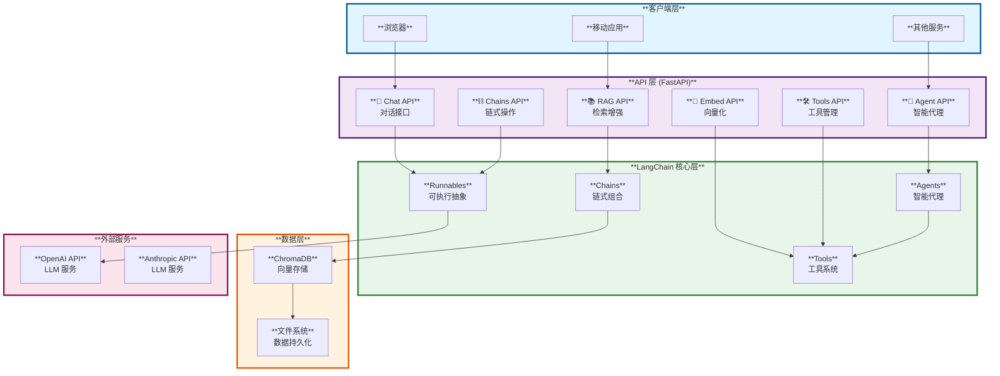

## 🔄 数据流程图

### Chat API 流程

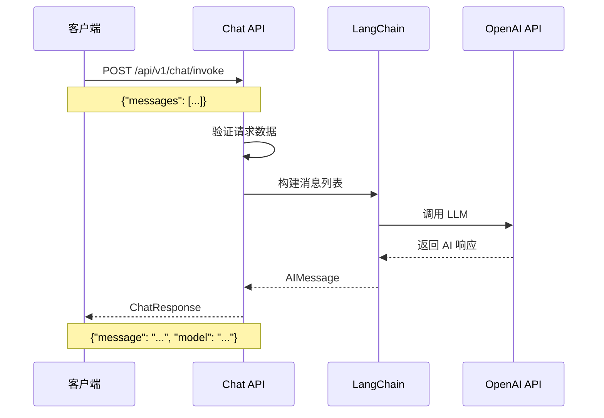

### RAG 查询流程

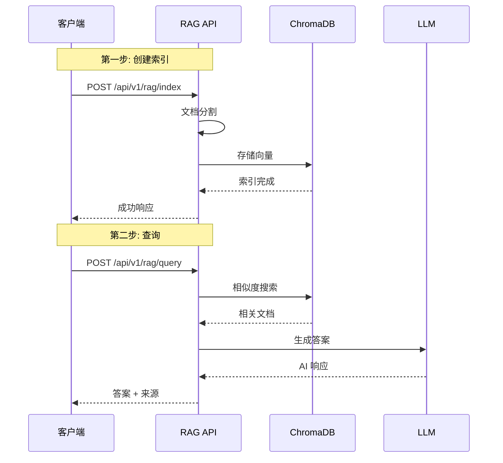

### Agent 执行流程

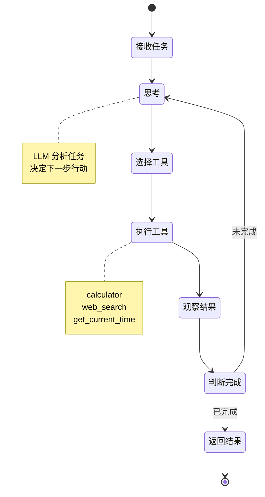

## 🗂️ 项目结构图

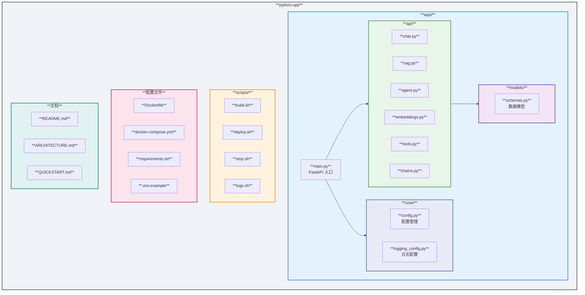

## 🔌 API 端点地图

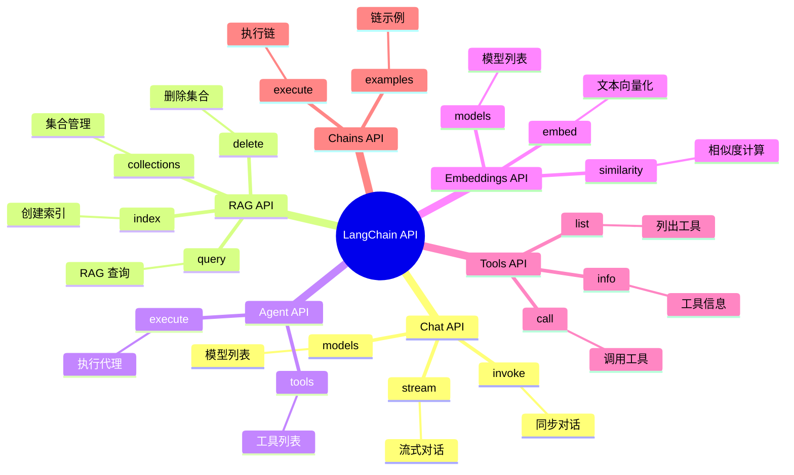

## 🐳 Docker 部署架构

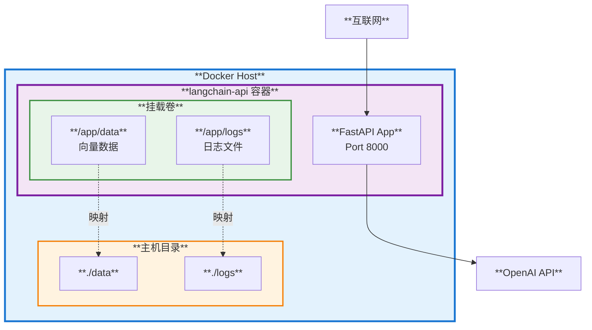

## 📦 依赖关系图

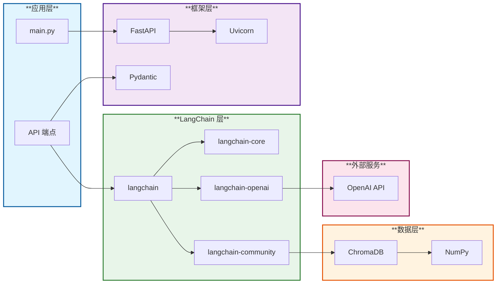

## 🔐 安全架构

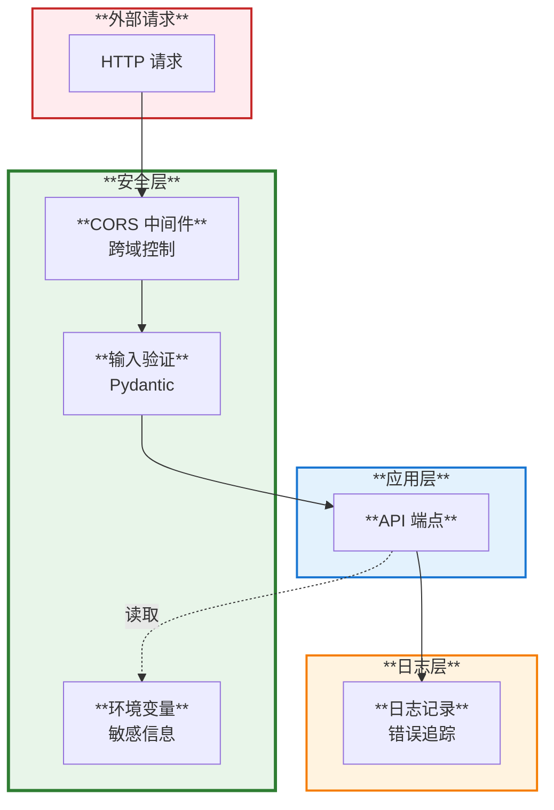

## 🚀 部署流程图

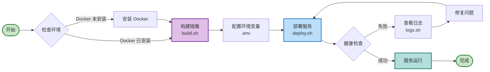

## 📊 性能架构

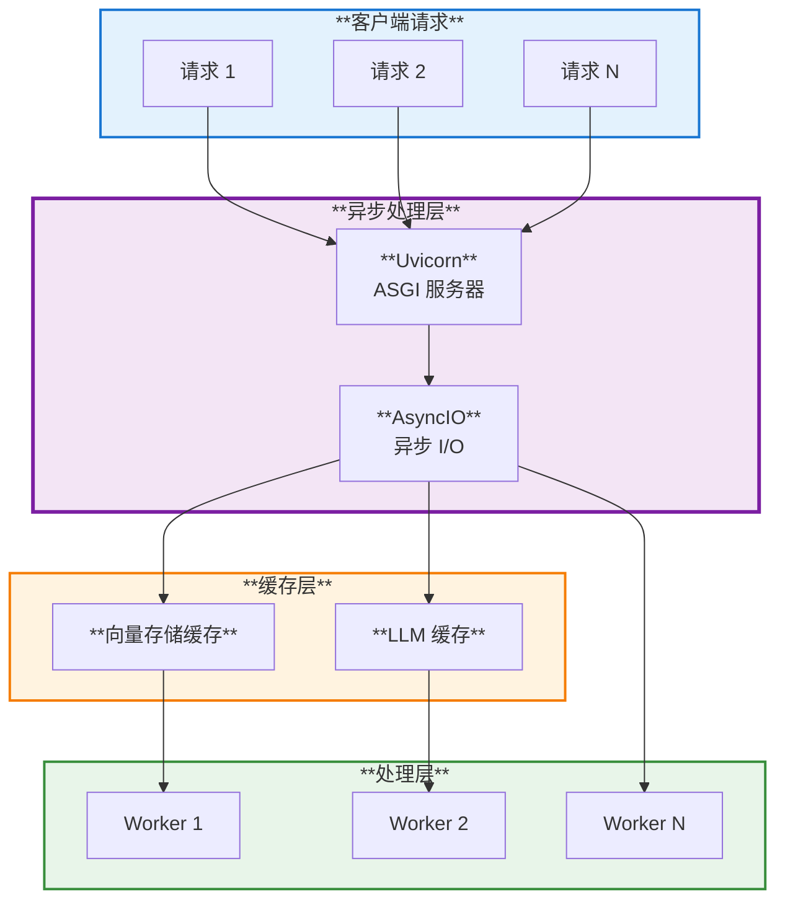

## 🔄 错误处理流程

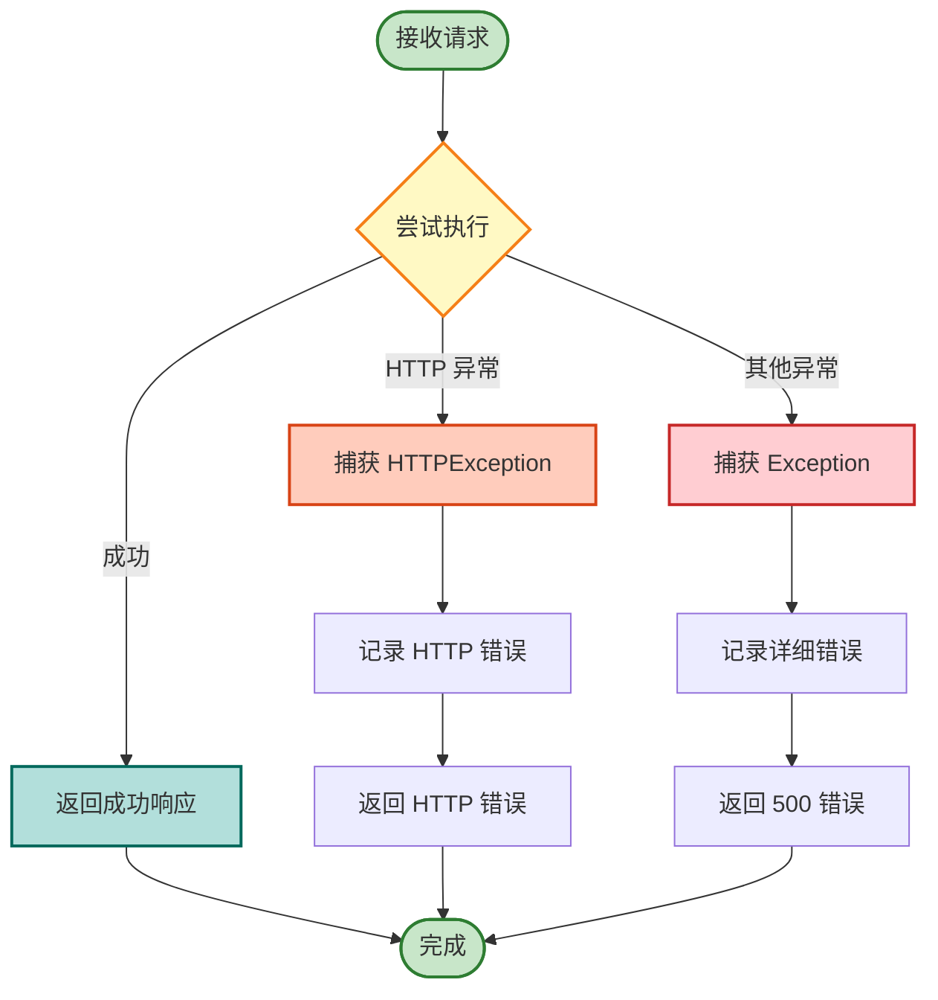

---

## 📋 图表说明

本文档包含 11 个架构图表：

1. **整体架构** - 展示系统分层结构
2. **Chat API 流程** - 对话接口时序图
3. **RAG 查询流程** - RAG 操作时序图
4. **Agent 执行流程** - Agent 状态机
5. **项目结构图** - 目录结构展示
6. **API 端点地图** - 思维导图展示所有端点
7. **Docker 部署架构** - 容器化部署结构
8. **依赖关系图** - 技术栈依赖
9. **安全架构** - 安全层级设计
10. **部署流程图** - 部署步骤流程
11. **性能架构** - 性能优化架构
12. **错误处理流程** - 错误处理机制

这些图表可以在支持 Mermaid 的 Markdown 查看器中正确渲染，如：
- GitHub
- GitLab
- VS Code (with Mermaid extension)
- Obsidian
- Typora
- [Mermaid Live Editor](https://mermaid.live)

---

**文档版本**: 1.0
**最后更新**: 2025-11-23
**图表数量**: 12

